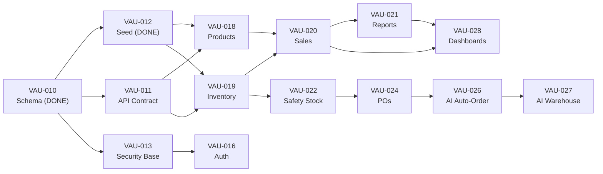

# Vaultory — End-to-End Implementation Plan (v2)

## Project: **Vaultory** — Small Business Inventory & Sales App (SBISA)

| **Document ID**    | IMP-PLAN-VAULTORY-001                                                               |
| ------------------ | ----------------------------------------------------------------------------------- |
| **Version**        | 2.0                                                                                 |
| **Status**         | Ready for execution (working doc)                                                   |
| **Prepared By**    | Anoop Gupta (SA/TL) + Devdarshan S (SM) — Vaultory                                  |
| **Date**           | 30/08/2026                                                                          |
| **Base Documents** | BRD v3.4 · SRS v1.1 · SOW v1.2 · Sprint Planner v2.2 (Jira tickets VAU-001…VAU-037) |
| **Jira Project**   | VAULTORY (key `VAU`)                                                                |

---

## Revision History

| Version | Date       | Author           | Description of Change                                                                                                                                                                                                                                                                                       |
| ------- | ---------- | ---------------- | ----------------------------------------------------------------------------------------------------------------------------------------------------------------------------------------------------------------------------------------------------------------------------------------------------------- |
| 1.0     | 29/08/2026 | Anoop Gupta (SA) | Initial end-to-end implementation plan mapped 1:1 to Jira tickets                                                                                                                                                                                                                                           |
| 1.1     | 29/08/2026 | Anoop Gupta (SA) | Synced ticket numbering to Sprint Planner v2.2                                                                                                                                                                                                                                                              |
| 1.2     | 30/08/2026 | Anoop Gupta (SA) | Re-synced Sprint 2/3 to full-stack module stories; updated test map, mileposts, risks                                                                                                                                                                                                                       |
| 2.0     | 30/08/2026 | Anoop Gupta (SA) | **Major rebuild** — adopted the richer v2 working plan as canonical: concrete file/endpoint/DDL detail per ticket; took the best of v1.2 (engineering standards, RBAC/masking/audit matrix, test map, runbook, mileposts, risks). Aligned schema/roles to the **actual built** `backend/src/db/schema.sql`. |

---

## Approvals

| Role / Designation  | Name           | Signature | Date |
| ------------------- | -------------- | --------- | ---- |
| Client / Sponsor    | Prof           |           |      |
| Project Manager     | Laxman Patel   |           |      |
| Business Analyst    | Ved Naik       |           |      |
| Solutions Architect | Anoop Gupta    |           |      |
| Scrum Master        | Devdarshan S   |           |      |
| Tech Lead           | Rohan Vashisht |           |      |

---

## Table of Contents

1. [Purpose & How to Use This Plan](#1-purpose--how-to-use-this-plan)
2. [Current Baseline (as of 30 Aug 2026)](#2-current-baseline-as-of-30-aug-2026)
3. [Target Architecture & Deployment Topology](#3-target-architecture--deployment-topology)
4. [Delivery Roadmap & Critical Path](#4-delivery-roadmap--critical-path)
5. [Engineering Standards (applies to every ticket)](#5-engineering-standards-applies-to-every-ticket)
6. [Sprint 1 — Foundations & Architecture](#6-sprint-1--foundations--architecture)
7. [Sprint 2 — Core Full-Stack Modules](#7-sprint-2--core-full-stack-modules)
8. [Sprint 3 — AI, Dashboards, Value-Adds, Test & Handover](#8-sprint-3--ai-dashboards-value-adds-test--handover)
9. [Data Entities per Module (source: schema.sql)](#9-data-entities-per-module-source-schemasql)
10. [Roles, RBAC & Masking Matrix](#10-roles-rbac--masking-matrix)
11. [Test Mapping (SRS §13 T-AC1…T-AC14)](#11-test-mapping-srs-13-t-ac1t-ac14)
12. [Release & Environment Runbook](#12-release--environment-runbook)
13. [Team Capacity & Workflow](#13-team-capacity--workflow)
14. [Weekly Mileposts & Progress Checks](#14-weekly-mileposts--progress-checks)
15. [Risks, Dependencies & Contingencies](#15-risks-dependencies--contingencies)

---

## 1. Purpose & How to Use This Plan

This is the **code-level companion to the Sprint Planner**. The Sprint Planner decides _what and when_; this plan decides _how_ — concrete files, routes and data shapes — so **any team member can pick up their Jira ticket, read its section here, and implement it without waiting for instructions**.

> **Jira sync rule:** ticket IDs, points and priorities below MUST match the Jira board. Scope/priority/assignee changes go through SM + PM and are reflected in both this doc and Jira.

### Roles on the team

| Role                  | How to use this plan                                                            |
| --------------------- | ------------------------------------------------------------------------------- |
| **Tech Lead (Rohan)** | Implement core back/frontend modules; enforce Engineering Standards §5 and DoD. |
| **SA (Anoop)**        | Own schema/API design foundation (VAU-010…014), AI tickets, deploy, masking.    |
| **BA (Ved)**          | Map tickets to BRD/SRS req IDs; validate AC; write the User Guide.              |
| **SM (Devdarshan)**   | Keep Jira in sync with this plan; track mileposts (§14); run ceremonies.        |
| **PM (Laxman)**       | Client comms, sign-offs, CR control; acceptance ticket VAU-035.                 |

### Ticket anatomy used below

```
VAU-XXX · [Story/Task] · <Title> · Pri · Pts · Req ID · (B)/(F)
What:      one-line outcome.
Backend:   files/routes/services to create.
Frontend:  pages/components/hooks to create.
DB:        tables/columns (final names per §9 — already in schema.sql).
AC:        acceptance criteria.
Depends:   tickets that must be Done before starting.
```

---

## 2. Current Baseline (as of 30 Aug 2026)

### Done ✅ (scaffold + schema/seed, lint + build clean)

| Area                         | Description                                                                                                       | Location                                        |
| ---------------------------- | ----------------------------------------------------------------------------------------------------------------- | ----------------------------------------------- |
| Frontend scaffold            | React 19 + Vite + TS, Tailwind v4, shadcn/ui (25 comps), `@` alias, barrels                                       | `frontend/src/`                                 |
| Frontend shell               | AppLayout + sidebar routing, theme (light/dark), responsive, 9 placeholder pages                                  | `frontend/src/components/layout/`, `router.tsx` |
| Frontend data/foundations    | TanStack Query provider, `api` client (token injection), zustand auth store + navbar user menu, RHF+zod, Recharts | `frontend/src/lib/`, `stores/`                  |
| Backend scaffold             | Express 5 + TS (ESM), zod env, Supabase client (anon + service-role), rate-limit, helmet, CORS                    | `backend/src/config/`, `app.ts`                 |
| Backend middleware           | error handler, validation, auth (`requireAuth`/`requireRoles`), health check                                      | `backend/src/middleware/`                       |
| Backend modules              | `health`, `auth` (signin/otp/me)                                                                                  | `backend/src/modules/`, `routes/`               |
| **DB schema (VAU-010)**      | Full production schema: enums, ~20 tables, constraints, indexes, RLS-ready                                        | `backend/src/db/schema.sql`                     |
| **Seed data (VAU-012 part)** | 3 stores + warehouse, categories/units, 20 products, 5 suppliers, opening inventory, safety-stock rules           | `backend/src/db/seed.sql`                       |
| Tooling                      | ESLint (both), Prettier (root), READMEs, env examples, gitignores                                                 | repo root                                       |
| Planning docs                | BRD · SRS · SOW · Sprint Planner · Implementation Plan                                                            | `Docs/`                                         |

### Needs Building ❌ (mapped to VAU tickets)

| Sprint | VAU Tickets            | What's Missing                                                                                                                                |
| ------ | ---------------------- | --------------------------------------------------------------------------------------------------------------------------------------------- |
| **S1** | VAU-006, 011, 013, 014 | CI/CD; API contract + zod schemas; RBAC/masking/audit utilities; frontend foundations (query hooks, shared UI kit, guards)                    |
| **S2** | VAU-016–025            | Auth flow, user admin, products+categories, inventory ops, sales+void/returns, reports, safety stock+alerts, suppliers, POs, RBAC enforcement |
| **S3** | VAU-026–037            | AI engine (Groq), AI warehouse recs, dashboards, value-adds, QA/UAT, user guide, handover                                                     |

---

## 3. Target Architecture & Deployment Topology

```
Browser ──► Vercel  (frontend: React SPA, /api proxied at build-time env)
                    │
                    ▼
        Render      (backend: Express API on port 4000, /api/*)
            │          │
            ▼          ▼
       Supabase     Groq AI
     Postgres      (LLM forecasting)
     Auth          (server-side, guarded by SERVICE_ROLE key)
     Storage
```

### Non-negotiables (from BRD v3.4 / SRS v1.1)

- Supabase is **infrastructure only** (Postgres, Auth, Storage). All business logic lives in the Node backend.
- **Masking:** PII / product-confidential fields masked at the API boundary for non-admin roles (VAU-013).
- **RBAC server-side:** every route re-checks role from Supabase JWT claims; UI is a consumer, never the enforcer.
- **Audit:** stock changes, sales, PO transitions and AI accept/override are append-only audited (VAU-029).
- Free-tier deployment: 1 Vercel project, 1 Render service, Supabase free, Groq credits.

---

## 4. Delivery Roadmap & Critical Path

### Dependency backbone

```
Sprint 1 (foundation)                              Sprint 2 (core modules)                 Sprint 3 (AI / value / QA)
┌────────────────────────────────────────────┐    ┌───────────────────────────────────┐   ┌──────────────────────────────┐
│ VAU-010  DB schema (DONE — gates all)      │    │ VAU-016/017  auth + user admin    │   │ VAU-026/027 AI ordering +   │
│ VAU-011  API contract + zod schemas        │───►│ VAU-018/019  products + inventory │──►│           warehouse recs     │
│ VAU-012  seed (DONE) + migrations run      │    │ VAU-020/021  sales + reports      │   │ VAU-028      dashboards + KPI│
│ VAU-013  security base (RBAC + masking)    │    │ VAU-022/023  safety-stock + suppl. │   │ VAU-029      value-adds     │
│ VAU-014  frontend foundations              │    │ VAU-024      PO module             │   │ VAU-030..037 QA/UAT/handover│
│                                           │    │ VAU-025      RBAC enforcement      │   │                             │
└────────────────────────────────────────────┘    └───────────────────────────────────┘   └──────────────────────────────┘
```

### Critical path (mermaid)



### Hard gates

| Gate                           | Date      | Exit criteria                                                                                                                    |
| ------------------------------ | --------- | -------------------------------------------------------------------------------------------------------------------------------- |
| **G1 — Schema freeze**         | ~31 Aug   | VAU-010 + VAU-011 signed; backend unblocked (schema already drafted)                                                             |
| **G2 — Sprint 1 review**       | 8 Sep     | Live skeleton (Vercel + Render + Supabase), signed specs, API contract + security base + frontend foundations                    |
| **G3 — Sprint 2 review**       | 19 Sep    | Client can log in, manage products/stock, record sales, view day/qtr/yr reports, manual PO flow, safety-stock alerts, user admin |
| **G4 — UAT phase**             | 24–28 Sep | T-AC1…T-AC14 pass; demo + UAT sessions                                                                                           |
| **G5 — Acceptance & handover** | 30 Sep    | Acceptance signed (VAU-035), handover complete (VAU-036)                                                                         |

---

## 5. Engineering Standards (applies to every ticket)

| Standard           | Rule                                                                                                                                            |
| ------------------ | ----------------------------------------------------------------------------------------------------------------------------------------------- |
| **API envelope**   | Success: `{ data: ... }` · Error: `{ error, message, code?, details? }` (as in `middleware/error.ts`)                                           |
| **Validation**     | All request bodies/params via zod schemas + `validate()` middleware; no manual parsing.                                                         |
| **Response shape** | List endpoints return `{ data: { items, total, page, pageSize } }` for paginated grids.                                                         |
| **Naming**         | Router factory functions (e.g. `createProductsRouter()`) per existing `modules/auth` pattern; registered in `routes/index.ts` barrel.           |
| **Module pattern** | `modules/<name>/` = `*.routes.ts` + `*.service.ts` + `*.schema.ts` + `index.ts` (barrel). Business logic in services, never inline in handlers. |
| **DB layer**       | `supabase-js` queries only in services; raw SQL via RPC only if needed. No N+1: batch selects.                                                  |
| **Auth**           | `requireAuth` then `requireRoles('admin', ...)`. Read ids from `req.storeId` / `req.role`.                                                      |
| **Masking**        | Apply `maskForRole(rows, user)` at the service boundary (VAU-013 design).                                                                       |
| **Audit**          | Change transactions write to `audit_logs` in the same service call; never on read.                                                              |
| **Frontend data**  | Pages use TanStack Query hooks (`useQuery`/`useMutation`) + `hooks/use<Entity>.ts`; sonner toasts.                                              |
| **Frontend UI**    | Grids via `Table` (in `overflow-x-auto`), forms via RHF + zod + `Form`, dialogs via `Dialog/Sheet`.                                             |
| **Export util**    | `lib/export.ts` — CSV + optional PDF via print; used by reports + bulk tickets.                                                                 |
| **Git/PR**         | One PR per ticket; branch `name/VAU-xxx-short`. Merged when lint + build + tests pass.                                                          |
| **Lint/format**    | `npm run lint` + `npm run format:check` from repo root must pass.                                                                               |
| **DoD checklist**  | Per Sprint Planner §8: code merged, AC met, live-env verified, RBAC/masking verified, no P0/P1, audit impact tested, docs updated.              |

---

## 6. Sprint 1 — Foundations & Architecture (29 Aug – 8 Sep)

**Sprint Goal:** Dev-ready foundation — API contract + security base + frontend foundations all merged; live skeleton on Vercel/Render.

**Committed points:** 71 pts (Must 58 + Should/Could 13)

> Schema (VAU-010) and seed (VAU-012 part) are **already built** at `backend/src/db/schema.sql` + `seed.sql`.

### VAU-006 · CI/CD (Should · 5 pts)

#### [NEW] `.github/workflows/ci.yml`

- Lint + build + typecheck on push/PR for both `backend/` and `frontend/`.

#### [MODIFY] Vercel/Render settings

- Connect GitHub repo for auto-deploy on `main` push.
- Set env vars (Supabase, Groq, CLIENT_ORIGIN).

---

### VAU-010 · Database Schema (Must · 13 pts) — ✅ built

**Status:** Done — `backend/src/db/schema.sql` (v1.0.0) defines the full model.
**Remaining:** apply as a Supabase migration (`supabase/migrations/001_initial.sql`) and generate `database.types.ts` → update `frontend/src/lib/types.ts`. **SA signs off; schema frozen.**
**Deliverables:** migration SQL, ERD (ASCII/Mermaid in Docs), generated types.
**Depends:** VAU-008, VAU-004.

---

### VAU-011 · API Contract & Shared Types (Must · 8 pts)

#### [NEW] `backend/src/lib/schemas/`

Zod schemas for every entity + request/response, organized by module:

- `products.schema.ts` — CreateProduct, UpdateProduct, ProductResponse
- `inventory.schema.ts` — StockIn, StockOut, Transfer, Adjust, InventoryResponse
- `sales.schema.ts` — CreateSale, SaleLineItem, SaleResponse, VoidSale
- `purchase-orders.schema.ts` — CreatePO, ReceivePO, POResponse
- `suppliers.schema.ts` — CreateSupplier, SupplierResponse
- `safety-stock.schema.ts` — SafetyStockConfig, SafetyStockResponse
- `users.schema.ts` — CreateUser, UpdateUser, UserResponse
- `alerts.schema.ts` — AlertResponse
- `reports.schema.ts` — Daily/Quarterly/Yearly report params
- `ai.schema.ts` — ForecastResponse, RecommendationResponse, AcceptRejectAction
- `common.schema.ts` — Pagination, ErrorEnvelope, IdParam

#### [NEW] `backend/src/lib/endpoints.ts`

Endpoint catalogue: every route, method, auth + role restriction — as code-commented reference.

---

### VAU-012 · Migrations & Seed (Must · 5 pts) — seed ✅ built

**Status:** `backend/src/db/seed.sql` already seeds 3 stores + 1 warehouse, categories/units, 20 products, 5 suppliers + mappings, opening inventory, safety-stock rules.
**Remaining:** wrap schema in a runnable migration; run on the real Supabase project; create test users (Supabase Auth + profiles on first login). **AC:** `supabase db push` clean; seed idempotent; test users can sign in.

---

### VAU-013 · Security Base — Backend (Must · 8 pts · FR-USER-02, FR-SEC-03)

#### [MODIFY] `backend/src/middleware/auth.ts`

- Align the `Role` type to the schema's `user_role` enum: `admin | store_staff | sales_personnel | senior_stakeholder` (BRD §12).
- Add store-scoping middleware: store staff can only access their own store's data.

#### [NEW] `backend/src/lib/masking.ts`

- `maskValue(value, role)` → `"••••"` for unauthorized roles, clear text for admin.
- Field-level masking config (which fields, which roles unmask).

#### [NEW] `backend/src/lib/audit.ts`

- `logAudit(actorId, action, entity, entityId, detail)` → appends to `audit_logs`.
- Masked values never written to audit detail.

#### [NEW] `backend/src/lib/db.ts`

- Supabase query helper with consistent error handling.
- Transaction wrapper for ACID operations (stock mutations).

#### [NEW] `backend/src/lib/permissions.ts`

- Permission matrix (BRD §12) as typed constant.
- `checkPermission(role, module, action)` → boolean; used alongside `requireRoles()`.

---

### VAU-014 · Frontend Foundations (Must · 8 pts)

#### [MODIFY] `frontend/src/lib/types.ts`

- Align to VAU-011 zod schemas; add all entity types (Location, Category, Unit, Supplier, SafetyStockRule, Alert, AiRecommendation, AuditLog, StockMovement).

#### [NEW] `frontend/src/lib/query-keys.ts`

- Centralized TanStack Query key factory for cache invalidation.

#### [NEW] `frontend/src/hooks/use-*.ts`

- `useProducts()`, `useInventory()`, `useSales()`, `usePurchaseOrders()`, `useSuppliers()`, `useAlerts()`, `useDashboard()` — Query hooks wrapping the API client.

#### [NEW] `frontend/src/components/shared/`

- `DataTable` (sort/filter/pagination), `FormDialog`, `StatusBadge` (IN/LOW/OUT/OVER), `CsvExportButton`, `PageHeader`, `EmptyState`, `ConfirmDialog`, `MaskedValue`.

#### [MODIFY] `frontend/src/router.tsx`

- Add `/login` route; auth guard (redirect to login if unauthenticated); role-based route protection per BRD §12.

#### [MODIFY] `frontend/src/stores/auth-store.ts`

- Wire to Supabase Auth SDK for session persistence; store full profile (role, store_id, name) from `/api/auth/me`; token refresh.

---

## 7. Sprint 2 — Core Full-Stack Modules (9 Sep – 19 Sep)

**Sprint Goal:** Every core module usable end-to-end — client can log in, manage products/stock, record sales, view reports, run POs with goods-in, safety-stock advisories live.

**Committed points:** 106 pts (Must 88 + Should 13 + Could 5)

> Each story is a **full-stack vertical slice** — one developer owns DB→API→UI for the whole module. `(B)` / `(F)` tags let two devs pair on a module in parallel.

---

### VAU-016 · Auth Module (Must · 13 pts · FR-USER-01, SRS T-AC10) · (B)+(F)

#### [MODIFY] `backend/src/modules/auth/auth.routes.ts`

- `POST /api/auth/signup` — create user via Supabase Auth + profile row
- `POST /api/auth/signin` — email/password sign-in
- `POST /api/auth/otp` — send email OTP magic link
- `POST /api/auth/verify-otp` — verify OTP code
- `POST /api/auth/forgot-password` — trigger password reset email
- `POST /api/auth/reset-password` — set new password with token
- `POST /api/auth/signout` — invalidate session
- `GET /api/auth/me` — authenticated profile with role

#### [NEW] `frontend/src/pages/login.tsx`

- Email + password form; email OTP / magic-link toggle; forgot-password flow; role-aware redirect after login.

#### [MODIFY] `frontend/src/stores/auth-store.ts` + router guard

- Full session lifecycle (login, logout, token refresh, persist); re-add `ProtectedRoute`; navbar shows **Sign in** / avatar+**Sign out**.

**AC:** Both credential paths sign in; session persists across refresh; sign-out clears; guards route unauthenticated users to `/auth`; role claim available for RBAC. **Depends:** VAU-010, VAU-011, VAU-013, VAU-014.

> **Post-deployment step — password reset handshake.** The recovery email is customized once the frontend is deployed and a real redirect URL is known:
> 1. In Supabase **Authentication → URL Configuration → Redirect URLs**, allow-list the deployed origin (e.g. `https://<frontend>.vercel.app/**`).
> 2. In **Authentication → Email Templates → Reset password**, customize the body so the link carries the raw token hash to the frontend, e.g.
>    `<a href="{{ .RedirectTo }}?token_hash={{ .TokenHash }}&type=recovery">Reset password</a>`.
> 3. The frontend `/reset-password` reads `?token_hash` and forwards it to `POST /api/auth/reset-password`; the backend `verifyOtp({ token_hash })` then sets the password via the **service-role** client (`supabaseAdmin.auth.admin.updateUserById`), so no SPA Supabase session hand-off is required.
> Before this step, `/reset-password` / `forgot-password` email delivery won't validate end-to-end.

---

### VAU-017 · User Admin Module (Must · 8 pts · FR-USER-03)

#### [NEW] `backend/src/modules/users/`

- `GET /api/users` — list (admin only), searchable/filterable
- `POST /api/users` — create (Supabase Auth + profile), assign role + store
- `PATCH /api/users/:id` — edit name, role, store
- `PATCH /api/users/:id/deactivate` — soft deactivate
- `POST /api/users/:id/reset-password` — trigger reset
- Guard: cannot deactivate self

#### [NEW] `frontend/src/pages/users.tsx`

- User DataTable with search, role/status filter; create/edit FormDialog; activate/deactivate toggle with ConfirmDialog.

**AC:** Admin creates/edits/deactivates users with role + store; search works; non-admin → 403. **Depends:** VAU-014, VAU-016, VAU-025.

---

### VAU-018 · Products & Categories Module (Must · 13 pts · FR-INV-01, FR-CAT) · (B)+(F)

#### [NEW] `backend/src/modules/products/`

- `POST /api/products` — create (admin only), SKU uniqueness, validate `target ≥ reorder ≥ safety`
- `GET /api/products` — list with search, filter (category/status), pagination; `cost_price` masked per role
- `GET /api/products/:id`, `PATCH /api/products/:id`
- `PATCH /api/products/:id/archive` — soft deactivate
- Errors: `409 SKU_ALREADY_EXISTS`, `422 INVALID_PRICE`

#### [NEW] `backend/src/modules/categories/`

- `GET /api/categories` — tree; `POST/PATCH` CRUD (no hard delete if in use). `GET/POST/PATCH /api/units`.

#### [NEW] `frontend/src/pages/products.tsx`

- Product DataTable (SKU, name, category, unit, sale_price, cost_price masked, status); search + filters; create/edit FormDialog; archive ConfirmDialog; category/unit inline management.

**AC:** CRUD works; archived hidden from POS but visible in inventory with badge; search server-side; categories/units CRUD (admin); validation inline. **Depends:** VAU-010, VAU-011, VAU-014.

---

### VAU-019 · Inventory & Stock Module (Must · 13 pts · FR-INV-03..08) · (B)+(F)

#### [NEW] `backend/src/modules/inventory/`

- `GET /api/inventory` — per-location stock grid with computed status badges (IN/LOW/OUT/OVER per SRS §4.1.3)
- `GET /api/inventory/:productId/:locationId` — single record
- `POST /api/inventory/stock-in` — `qty_on_hand += qty`, optional PO link, writes `stock_movements`
- `POST /api/inventory/stock-out` — `qty_on_hand -= qty`, no-negative guard (`409 INSUFFICIENT_STOCK`), reason required
- `POST /api/inventory/transfer` — atomic from→to (single tx, net zero)
- `POST /api/inventory/adjust` — cycle count: compute variance, confirm → set qty, audit log
- After every mutation: re-evaluate status, trigger LOW/OUT alert
- Store staff scoped to own store

#### [NEW] `frontend/src/pages/inventory.tsx` (replaces placeholder)

- Location selector (store/warehouse); stock DataTable (product, on-hand, safety, reorder, target, status badge, last-updated); per-row Stock-In/Out/Transfer/Adjust dialogs; variance preview before adjust; sonner toast; store staff see only their store.

**AC:** Counts correct per store; adjust requires admin/owner permission; out/transfer can't go negative (409 + clean error); every movement writes audit; transfer updates both locations; negatives impossible at API and DB. **Depends:** VAU-018, VAU-010, VAU-011.

---

### VAU-020 · Sales Module (Must · 13 pts · FR-SAL-01, FR-SAL-04) · (B)+(F)

#### [NEW] `backend/src/modules/sales/`

- `POST /api/sales` — record sale (store, datetime, line items): server-computes totals, auto-deducts stock per line at sale's store, blocks `qty > on-hand` (`409 INSUFFICIENT_STOCK` per product), writes `stock_movements` + `audit_logs`; sale immutable after save (except void)
- `GET /api/sales` — list (filters: store, date range), pagination
- `GET /api/sales/:id` — detail with line items
- `POST /api/sales/:id/void` — admin only, reason required, restores stock, marks voided, audited
- `POST /api/sales/:id/return` — return line items, stock increase, negative sale recorded

#### [NEW] `frontend/src/pages/sales.tsx` (replaces placeholder)

- Record-sale form: store selector, line items table (product autocomplete, qty, price), live totals, inline sufficiency check; save → toast; sale-history list with detail; Void (admin-only) with reason ConfirmDialog.

**AC:** Valid sale deducts stock & creates order + audit entry; insufficient stock blocked per-line; sale visible in reports; void restores stock + audited; return increases stock + recorded; unauthorized roles blocked. **Depends:** VAU-019, VAU-011.

---

### VAU-021 · Reports Module (Must · 13 pts · FR-SAL-02, FR-SAL-03, FR-MON-01) · (B)+(F)

#### [NEW] `backend/src/modules/reports/`

- `GET /api/reports/sales/daily` — filter store/product/date → units_sold, sales_value by store/product
- `GET /api/reports/sales/quarterly` — filter store/product, quarter (`YYYY-Qq`)
- `GET /api/reports/sales/yearly` — filter store/product, year
- `GET /api/reports/store-performance` — per-store totals + cross-store comparison
- All sortable, support CSV/PDF export format

#### [NEW] `frontend/src/pages/reports.tsx` (replaces placeholder)

- Tabs: Daily / Quarterly / Yearly / Store Performance; filter bar; DataTable results; Recharts bar/line trends; export CSV + PDF; store-wise comparison chart.

**AC:** Correct totals per period; store + date-range filters; CSV matches screen; sales-person view shows own store only; others see all. **Depends:** VAU-020, VAU-019.

---

### VAU-022 · Safety Stock & Alerts (Should · 8 pts · FR-SST-01, FR-SST-02, FR-ALR-01)

#### [NEW] `backend/src/modules/safety-stock/`

- `GET /api/safety-stock` — rules per product/location
- `PUT /api/safety-stock/:productId/:locationId` — set/update (validate `target ≥ reorder ≥ safety ≥ 0`)
- `auto_order_enabled` toggle per rule

#### [NEW] `backend/src/modules/alerts/`

- Alert creation on LOW/OUT transitions (from inventory mutations)
- `GET /api/alerts` — role-scoped (admin all, staff own store)
- `PATCH /api/alerts/:id/read` — mark read
- `GET /api/alerts/unread-count` — header badge

#### [NEW] `frontend/src/pages/safety-stock.tsx` + `components/alerts-center.tsx`

- Config table (product × location, inline-edit safety/reorder/target/auto-order toggle); validation; "Suggest by AI" stub (wired in S3). Bell icon + unread badge in header/sidebar; dropdown panel with read/unread + type filter; click-through to product/location.

**AC:** Config saved per location + audited; low/out alerts instant on stock-out ops; staff see own store, admin all; no duplicate alerts. **Depends:** VAU-019, VAU-017, VAU-025.

---

### VAU-023 · Suppliers Module (Should · 8 pts · FR-PRO-01, FR-SUP-01..04)

#### [NEW] `backend/src/modules/suppliers/`

- `POST /api/suppliers` — create (admin only); `GET /api/suppliers` (search); `GET /api/suppliers/:id`; `PATCH /api/suppliers/:id`
- `POST /api/suppliers/:id/products` — map products (many-to-many)
- `GET /api/suppliers/:id/performance` — on-time %, effective lead time

#### [NEW] `frontend/src/pages/suppliers.tsx`

- Supplier DataTable (name, contact, lead time, status, reliability score); create/edit FormDialog; product-mapping panel (multi-select); performance column (wired once POs exist).

**AC:** Map product↔supplier with default lead time (used by VAU-024); performance metrics populate from PO history. **Depends:** VAU-018, VAU-024.

---

### VAU-024 · Purchase Order Module (Must · 13 pts · FR-PRO-02..06) · (B)+(F)

#### [NEW] `backend/src/modules/purchase-orders/`

- `POST /api/purchase-orders` — manual PO (supplier, destination, line items); auto `po_number` (`PO-YYYY-SEQ`); `expected_date = order_date + supplier.lead_time_days`
- `GET /api/purchase-orders` — filter status/supplier/destination; `GET /api/purchase-orders/:id` — detail + receipt progress
- `PATCH /api/purchase-orders/:id/status` — lifecycle `DRAFT → SENT → PARTIALLY_RECEIVED → RECEIVED → CLOSED`; any → `CANCELLED`; transitions logged
- `POST /api/purchase-orders/:id/receive` — goods-in: per-line `received_qty`, stock increase at destination; partial → `PARTIALLY_RECEIVED`; all lines full → `RECEIVED`; over-receipt guard (`received_qty + previous ≤ ordered_qty`)
- Duplicate-open-PO prevention: block if open PO exists for (product, destination)

#### [NEW] `frontend/src/pages/purchase-orders.tsx` (replaces placeholder)

- PO list (number, supplier, destination, status badge, expected date, receive progress bar); detail view (ordered vs received per line); create manual PO form; receive dialog per line; status-transition buttons (Send, Cancel, Close).

**AC:** PO number generated; line items validated against product↔supplier mapping; invalid transition → 409; cannot receive twice; cannot edit sent; partial receipt correct; stock up by received qty; duplicate open PO blocked. **Depends:** VAU-018, VAU-023, VAU-019.

---

### VAU-025 · RBAC Enforcement (Should · 5 pts · FR-USER-02)

#### [MODIFY] All backend route files

- Apply `requireAuth` + `requireRoles(...)` per BRD §12 matrix to every route; store-scoping (staff → `req.storeId`).

#### [MODIFY] `frontend/src/components/layout/app-sidebar.tsx` + `router.tsx`

- Conditionally show/hide nav items by role; route-level role guards (redirect if unauthorized).

**AC:** Role-by-role route test passes (matrix §10); unauthorized → 403; menus hidden for restricted items. **Depends:** VAU-013, VAU-016.

---

## 8. Sprint 3 — AI, Dashboards, Value-Adds, Test & Handover (20 Sep – 30 Sep)

**Sprint Goal:** AI features live, executive + KPI dashboards, value-adds (capacity permitting), QA/UAT passed, product accepted and handed over.

**Committed points:** 79 pts (Must 43 + Should 23 + Could 13; excl. variable defect fixes)

---

### VAU-026 · AI Auto-Ordering (Must · 13 pts · FR-AI-01, FR-AI-03, SRS §8.1) · (B)+(F)

#### [NEW] `backend/src/modules/ai/groq-client.ts`

- Groq API wrapper (chat completions) with retry, timeout, rate-limit handling; key from `GROQ_API_KEY`; graceful degradation if key missing/unavailable.

#### [NEW] `backend/src/modules/ai/forecast.ts`

- Demand forecasting: input = sales history (90-day window, min 14 days); primary = structured Groq prompt → demand + reasoning; fallback = SMA in Node if Groq unavailable/insufficient data; output `{ predicted_demand, confidence, reasoning, sourced_from_ai }`.

#### [NEW] `backend/src/modules/ai/auto-order.ts`

- Auto-ordering flow (SRS §8.1): 1) scan products where `qty_on_hand ≤ reorder_point` at any location; 2) skip if `auto_order_enabled = false` → alert only; 3) skip if open PO exists for (product, location); 4) skip if no supplier → `NO_SUPPLIER` alert; 5) `reorder_qty = max(0, target_level − on_hand − open_po_qty)`, `max(..., ceil(forecast))` if available; 6) create PO (DRAFT or auto-SENT per config); 7) edge cases (no history → fallback; missing lead time → default 7d + alert). Trigger: POST endpoint (cron-callable) + after-stock-mutation hook. Inputs/outputs → `ai_recommendations`.

#### [NEW] `frontend/src/pages/auto-order.tsx` (replaces placeholder)

- AI Recommendation Center: pending recs table (product, location, suggested qty, reasoning, confidence); Accept (creates PO) / Modify / Reject (logged); history tab.

**AC:** AI + fallback both work; accept/modify/reject audited; drafts never auto-submit; fallback unit-tested (no ∞/NaN). **Depends:** VAU-022, VAU-024, VAU-019.

---

### VAU-027 · AI Warehouse Recommendations (Must · 13 pts · FR-AI-02, SRS §8.2) · (B)+(F)

#### [NEW] `backend/src/modules/ai/warehouse-recommend.ts`

- Per (product, warehouse): `forecast × (lead_time + safety_buffer)`; Groq for rationale (fallback template if unavailable); clamp to `[safety_stock, target_level]`; store with rationale in `ai_recommendations`.

#### [MODIFY] `frontend/src/pages/auto-order.tsx` + `safety-stock.tsx`

- "Warehouse Recommendations" tab (cards with rationale, Accept/Modify/Reject → updates `safety_stock_rules`); wire the safety-stock page's "Suggest by AI" button to the recommendation endpoint + rationale modal.

**AC:** Recommendation shows `reason`; rejected logged (no config change); accepted updates safety-stock config; all actions audited. **Depends:** VAU-022, VAU-019.

---

### VAU-028 · Dashboard Module (Must · 8 pts · FR-MON-02, FR-DSH) · (B)+(F)

#### [NEW] `backend/src/modules/dashboard/`

- `GET /api/dashboard/summary` — total stock value (Σ qty × cost_price), inventory turnover, low-stock count, out-of-stock count, today's sales + order count, auto-orders pending
- `GET /api/dashboard/revenue-trend` — daily revenue last 30 days
- `GET /api/dashboard/top-products` — top 10 by qty sold (rolling 30d)
- `GET /api/dashboard/store-comparison` — per-store totals

#### [NEW] `frontend/src/pages/dashboard.tsx` + `pages/executive-dashboard.tsx` (replace placeholders)

- **Role-aware layout:** Admin/Senior — KPI cards + revenue-trend line chart + top-products bar chart + low-stock list; Store Staff — own-store stock summary + quick stock actions; Sales — today's sales + store performance. All widgets clickable → detail page.
- **Executive dashboard** (Senior/Admin): consolidated all-store inventory health + sales summary; store comparison grouped bar chart; drill-down to filtered view.

**AC:** Data from live backend; drill-down to store; KPIs update on data change; correct number formatting. **Depends:** VAU-020, VAU-021, VAU-019.

---

### VAU-029 · Value-Add Modules (Could · 13 pts · FR-FSM, FR-BULK, FR-AUD, FR-ONB, FR-ALR, FR-CAT)

> Delivered only if Must/Should items are ahead. Each sub-module is independently droppable.

- **Fast/Slow Mover Classification** (FR-FSM): `GET /api/products/movers` by 90-day sales velocity, configurable thresholds; badge + dashboard widget.
- **Bulk CSV Import/Export** (FR-BULK): `POST /api/bulk/import/products` (upload, validate, per-row result); `GET /api/bulk/export/:entity` (CSV, respects masking); import dialog + export buttons.
- **Audit Log Viewer** (FR-AUD): `GET /api/audit-logs` (admin only, filterable + paginated); `pages/audit-logs.tsx` read-only DataTable.
- **Onboarding Wizard** (FR-ONB): `pages/onboarding.tsx` 6-step guided setup (locations → users → products → suppliers → opening stock → safety stock); skippable, resumable.
- **Alert Preferences** (FR-ALR): per-user alert-type toggles; settings panel.
- **Categories & units grouping** (FR-CAT): grouping in reports (units already landed in VAU-018).

**Depends:** VAU-018, VAU-019, VAU-022.

---

### VAU-030 · Full Test Pass (Must · 8 pts · SRS §13)

Execute T-AC1…T-AC14 (§11 table); log results; file bugs in Jira with severity. Each fix = PR + re-test the affected T-AC.

| Test   | What                                                    | Expected                                           |
| ------ | ------------------------------------------------------- | -------------------------------------------------- |
| T-AC1  | View stock for all products across 3 stores + warehouse | Grid shows correct qty & status, ≤3s               |
| T-AC2  | Stock-In/Out/Transfer/Adjust                            | qty updates; no negative; audit logged             |
| T-AC3  | Record sale → check stock & reports                     | Totals correct; stock decremented; reports reflect |
| T-AC4  | Safety-stock config + stock below reorder               | LOW_STOCK alert; reorder evaluation                |
| T-AC5  | Auto-order at reorder point                             | Auto-PO generated with correct qty                 |
| T-AC6  | PO end-to-end                                           | Status transitions; goods-in increases stock       |
| T-AC7  | AI warehouse recommendation                             | Rationale shown; accept/modify/reject works        |
| T-AC8  | Sales personnel store performance                       | Per-store + comparison correct                     |
| T-AC9  | Executive dashboard                                     | KPIs + drill-down, near real-time                  |
| T-AC10 | Login (email/password + OTP) + RBAC                     | Auth works; unauthorized → 403                     |
| T-AC11 | Masking                                                 | Cost price masked to non-admin in API/DB/exports   |
| T-AC12 | Hosting                                                 | Live on Vercel + Render + Supabase                 |
| T-AC13 | Performance                                             | Dashboards ≤3s                                     |
| T-AC14 | Out-of-scope                                            | Client sign-off confirmed                          |

---

### VAU-031 · Fix Internal Defects (Must · var) — P0/P1 first; each fix = PR + re-test affected T-AC.

### VAU-032 · Client Demo + UAT (Must · 3) — Demo script (Sprint Planner §11), UAT session(s), capture findings.

### VAU-033 · Fix UAT Defects (Must · var) — In-scope only; others → CR via PM.

### VAU-034 · User Guide (Must · 3) — `Docs/User_Guide.md`: per-role walkthrough (login + key tasks + screenshots) for Admin, Store Staff, Sales, Senior.

### VAU-035 · Acceptance Sign-off (Must · 2 · SOW §7) — T-AC1…T-AC14 form signed by client.

### VAU-036 · Handover (Must · 3 · SOW D-9) — Source; deploy access/instructions; credentials; DB backup; `Docs/Handover.md`.

### VAU-037 · Final Report + Retro (Should · 2) — Lessons learned + final status to `Docs/`.

---

## 9. Data Entities per Module (source: schema.sql)

> Canonical definitions live in `backend/src/db/schema.sql` (v1.0.0). Table names/types below are final.

| Module            | Entities (tables)                                                                                                                          |
| ----------------- | ------------------------------------------------------------------------------------------------------------------------------------------ |
| Identity & Access | `profiles` (linked to `auth.users`), `locations`, `onboarding_progress`                                                                    |
| Products          | `products`, `categories`, `units`                                                                                                          |
| Inventory         | `inventory` (`product_id` × `location_id`, `qty_on_hand`), `stock_movements` (in/out/transfer/adjust/sale/void/return/po_receipt)          |
| Sales             | `sales`, `sale_lines`                                                                                                                      |
| Safety stock      | `safety_stock_rules` (`reorder_point`, `safety_stock`, `target_level`, `auto_order_enabled`), `alerts`, `alert_reads`, `alert_preferences` |
| Suppliers         | `suppliers`, `supplier_products` (`lead_time`)                                                                                             |
| Purchase          | `purchase_orders` (`po_number`, status/source enums), `po_lines`                                                                           |
| AI                | `ai_recommendations` (type/status enums, reasoning), `app_settings`                                                                        |
| Audit             | `audit_logs` (append-only, actor/action/entity, JSON detail)                                                                               |

**Key enums** (in schema.sql): `user_role` (4 roles), `movement_type`, `po_status` (draft→sent→partially_received→received→closed→cancelled), `po_source` (manual/ai_auto), `sale_status` (active/voided), `alert_type`, `ai_recommendation_type/status`, `stock_status`.

---

## 10. Roles, RBAC & Masking Matrix

### Roles — BRD §12 (canonical, matches schema `user_role`)

| BRD role               | Scope                                                             |
| ---------------------- | ----------------------------------------------------------------- |
| **admin**              | All modules, all stores; masking overrides; audit viewer          |
| **store_staff**        | Own store: stock operations, goods-in                             |
| **sales_personnel**    | Own store: record sales, view performance                         |
| **senior_stakeholder** | All stores: dashboards, executive monitoring, reports (read-only) |

### RBAC capability matrix (input to VAU-013/025)

| Capability                              | Admin | Store Staff | Sales          | Senior     |
| --------------------------------------- | ----- | ----------- | -------------- | ---------- |
| Manage products, stock adjust, settings | ✅    | —           | —              | —          |
| Stock in/out/transfer                   | ✅    | ✅          | —              | —          |
| Record sales                            | ✅    | —           | ✅ (own store) | —          |
| Safety-stock config                     | ✅    | view        | —              | —          |
| Suppliers & manual PO                   | ✅    | view        | —              | —          |
| PO receive, AI accept/modify/reject     | ✅    | —           | —              | —          |
| Reports                                 | ✅    | own store   | own store      | all (read) |
| Audit log viewer, masking overrides     | ✅    | —           | —              | —          |
| Executive dashboard                     | ✅    | —           | —              | ✅         |

> **Note:** the backend `middleware/auth.ts` `Role` type (`owner | store_manager | staff`) predates the schema's `user_role` enum. **Standardize on the 4-role `user_role` enum (BRD §12 / schema.sql)** during VAU-013 — update the `Role` type + `requireRoles` accordingly. Do not ship the two role sets side-by-side.

### Masking (VAU-013)

- Roles < admin: `cost_price`, margin, supplier finance, customer identity → `••••` / masked; revenue/units totals remain visible.
- Masking applied in backend services only; frontend never receives the raw field.

### Audit (VAU-029)

- Every `stock_movements`, sale, PO transition, AI accept/reject, product edit writes `audit_logs`.
- Rows never updated/deleted; viewer is admin-only.

---

## 11. Test Mapping (SRS §13 T-AC1…T-AC14)

> Executed as part of VAU-030.

| SRS Test | Verifies (SRS §13)                                                   | Primary modules |
| -------- | -------------------------------------------------------------------- | --------------- |
| T-AC1    | Stock grid across 3 stores + warehouse (correct qty/status, ≤3s)     | VAU-019         |
| T-AC2    | Stock-In/Out/Transfer/Adjust; no negatives; audit logged             | VAU-019         |
| T-AC3    | Record sale → stock ded + day/qtr/yr reports reflect it              | VAU-020/021     |
| T-AC4    | Safety-stock config + below reorder → LOW_STOCK alert + reorder eval | VAU-022         |
| T-AC5    | Auto-order + stock ≤ reorder → auto-PO generated                     | VAU-026         |
| T-AC6    | Full PO lifecycle + goods-in increases stock                         | VAU-024         |
| T-AC7    | AI warehouse recommendation + accept/modify/reject logged            | VAU-027         |
| T-AC8    | Sales-perf view (sales personnel) per-store + comparison             | VAU-021         |
| T-AC9    | Executive dashboard KPIs + drill-down, near real-time                | VAU-028         |
| T-AC10   | Login email/password + email OTP (Supabase) + RBAC (403)             | VAU-016/025     |
| T-AC11   | Masking of cost/PII to unauthorized roles incl. DB/exports           | VAU-013/029     |
| T-AC12   | Hosting live: Vercel + Render + Supabase free tier                   | VAU-004/005     |
| T-AC13   | Performance: dashboards ≤3s p95; reports ≤5 min                      | VAU-028/030     |
| T-AC14   | Out-of-scope confirm: client sign-off in BRD §9                      | VAU-035         |

---

## 12. Release & Environment Runbook

| Env     | Backend                            | Frontend                   | DB/AI                                | Trigger                |
| ------- | ---------------------------------- | -------------------------- | ------------------------------------ | ---------------------- |
| Dev     | `npm run dev` (tsx watch, :4000)   | Vite (:5173, proxy `/api`) | local Supabase placeholder (VAU-004) | manual                 |
| Staging | Render preprod or local prod build | Vercel preview             | real Supabase project                | PR merge               |
| Prod    | Render web service                 | Vercel prod                | Supabase + Groq                      | `main` merge (VAU-006) |

- Env vars live in Vercel/Render dashboards. `.env.*` gitignored; `.env.example` is the source of truth.
- Migration order on release: **supabase → backend → frontend** (never frontend first). Rollback: Render redeploy previous release + down-migration as last resort.

---

## 13. Team Capacity & Workflow

- **5 developers** collaborate on the module backlog; no single ticket is pre-assigned to a named person.
- Each **module story** is a vertical slice (DB → API → UI) owned by **one developer** end-to-end during the sprint; `(B)` / `(F)` splits let two developers pair in parallel.
- The **Tech Lead / SA** review every module PR against the RBAC, masking and audit cross-cutting rules (§10) before merge.
- Pull/assignment decisions are made at **sprint planning** and recorded in Jira (assignee field), not fixed in this document.
- Team velocity target ≈ 50–55 pts/sprint (planner §10); that constraint drives how many modules fit per sprint.

> Modules are sized so each developer picks up **≈1 module per week**; the module count per sprint aligns with 5 devs × 2 weeks.

### Parallelization opportunities

| Can run in parallel                            | Why                                |
| ---------------------------------------------- | ---------------------------------- |
| VAU-011 (API) + VAU-014 (Frontend foundations) | Backend vs frontend, no dependency |
| VAU-016 (Auth) + VAU-018 (Products)            | Independent modules after schema   |
| VAU-019 (Inventory) + VAU-023 (Suppliers)      | Independent data domains           |
| VAU-020 (Sales) ∥ VAU-024 (POs)                | After inventory, both can proceed  |
| VAU-026 (AI) ∥ VAU-028 (Dashboard)             | Independent Sprint 3 modules       |
| VAU-029 sub-modules                            | All independent of each other      |

### If time gets tight — what to cut

| Priority   | Item                                                                        | Impact                              |
| ---------- | --------------------------------------------------------------------------- | ----------------------------------- |
| Cut first  | VAU-029: onboarding, alert prefs, fast/slow movers                          | Nice-to-have; no core-score impact  |
| Cut second | VAU-029: bulk import/export                                                 | Manual entry still works            |
| Cut third  | VAU-022: safety-stock config UI                                             | Alerts still work from inventory    |
| Never cut  | VAU-026/027 (AI), VAU-028 (Dashboard), VAU-020 (Sales), VAU-019 (Inventory) | Core problem-statement requirements |

---

## 14. Weekly Mileposts & Progress Checks

| Week ending | Must show (SM checks on Friday)                                                          |
| ----------- | ---------------------------------------------------------------------------------------- |
| 30 Aug      | VAU-010 schema draft submitted for review (G1 31 Aug) — **done**                         |
| 6 Sep       | VAU-011 API contract + zod schemas; VAU-013 security base; VAU-014 frontend foundations  |
| 13 Sep      | Products & categories + inventory + sales live on staging (VAU-018/019/020 core)         |
| 20 Sep      | PO + safety stock + auth/user admin done (VAU-016/017/022/023/024); Sprint 2 review (G3) |
| 27 Sep      | AI VAU-026/027 live; dashboards VAU-028; T-AC pass VAU-030; demo (G4)                    |
| 30 Sep      | Acceptance signed (VAU-035); handover (VAU-036); retro (VAU-037) (G5)                    |

---

## 15. Risks, Dependencies & Contingencies

| Risk                                | Impact                  | Mitigation                                                             |
| ----------------------------------- | ----------------------- | ---------------------------------------------------------------------- |
| Schema late → Sprint 2 slips        | Critical                | VAU-010 drafted; G1 31 Aug; freeze new fields behind CR                |
| Groq key/credits unavailable        | AI blocked              | VAU-026 deterministic fallback in same module; `sourced_from_ai=false` |
| Role-set divergence (3 vs 4)        | RBAC bugs               | Standardize on schema `user_role` in VAU-013; single source of truth   |
| Free-tier cold starts on Render     | Demo latency            | Keep warm or accept; demo on seeded staging instance                   |
| Supabase free-auth rate limits      | OTP/signin flaky in UAT | In-app login during UAT; note in User Guide                            |
| Velocity overestimated (~50/sprint) | Should/Could slip       | Trim VAU-022/023/025/029 first — Musts protected                       |
| Underspecified ACs mid-build        | Rework                  | ACs mapped in VAU-011 contract; BA validates in refinement             |

---

## Approval Sign-off

| Role / Designation  | Name           | Signature | Date |
| ------------------- | -------------- | --------- | ---- |
| Client / Sponsor    | Prof           |           |      |
| Project Manager     | Laxman Patel   |           |      |
| Business Analyst    | Ved Naik       |           |      |
| Solutions Architect | Anoop Gupta    |           |      |
| Scrum Master        | Devdarshan S   |           |      |
| Tech Lead           | Rohan Vashisht |           |      |

---

_End of Implementation Plan — Version 2.0 · Project: Vaultory · Team: Vaultory_
