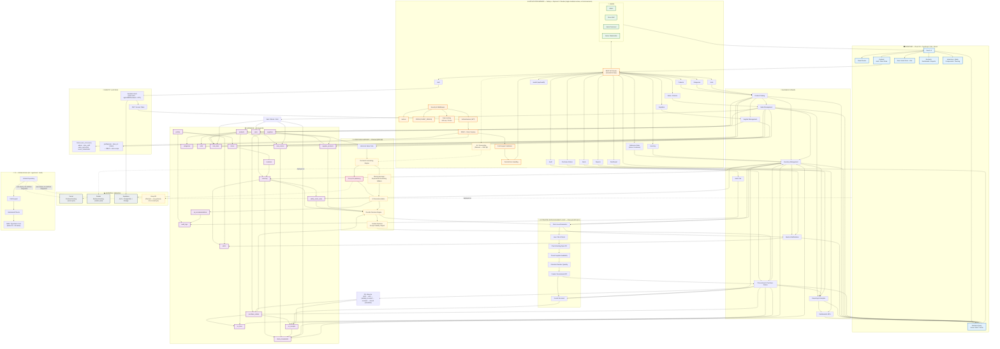

```mermaid
flowchart TB

    %% =========================================================
    %% USERS
    %% =========================================================
    subgraph USERS["👥 USERS"]
        ADMIN["Admin"]
        STAFF["Store Staff"]
        SALES["Sales Personnel"]
        STAKE["Senior Stakeholder"]
    end

    %% =========================================================
    %% FRONTEND
    %% =========================================================
    subgraph FRONTEND["🖥️ FRONTEND — React 19 + TypeScript / Vite / Vercel"]
        UI["React UI"]
        ROUTER["React Router"]
        ZUSTAND["Zustand<br/>Auth / Client State"]
        QUERY["TanStack Query<br/>Server State / Cache"]
        FORMS["React Hook Form + Zod"]
        CHARTS["Recharts<br/>Dashboards / Reports"]
        SHADCN["shadcn/ui + Radix<br/>Components / Theming"]

        UI --> ROUTER
        UI --> ZUSTAND
        UI --> QUERY
        UI --> FORMS
        UI --> CHARTS
        UI --> SHADCN
    end

    %% =========================================================
    %% API / SECURITY
    %% =========================================================
    subgraph API["⚙️ APPLICATION SERVER — Node.js + Express 5 / Render (single modular service, not microservices)"]

        MIDDLEWARE["Security & Middleware"]

        HELMET["Helmet"]
        CORS["CORS (CLIENT_ORIGIN)"]
        RATE["Rate Limiting<br/>500 req / 15 min"]
        AUTHMW["Authentication (JWT)"]
        RBAC["RBAC + Store Scoping"]
        VALIDATE["Zod Request Validation"]
        ERRORS["Central Error Handling"]

        MIDDLEWARE --> HELMET
        MIDDLEWARE --> CORS
        MIDDLEWARE --> RATE
        MIDDLEWARE --> AUTHMW
        AUTHMW --> RBAC
        RBAC --> VALIDATE
        VALIDATE --> ERRORS

        ROUTES["REST API Router<br/>(mounted at /api)"]

        AUTH["Auth"]
        USERS["Users"]
        PRODUCTS["Products"]
        CATEGORIES["Categories"]
        UNITS["Units"]
        REFERENCE["Reference Data<br/>(stores / locations)"]
        INVENTORY["Inventory"]
        SALES_M["Sales + Returns"]
        SUPPLIERS["Suppliers"]
        POS["Purchase Orders"]
        REPORTS["Reports"]
        DASHBOARD["Dashboard"]
        ALERTS["Alerts"]
        AUDIT["Audit"]
        HEALTH["Health (/api/health)"]
        AIROUTE["AI / Forecasting<br/>(Planned — SRS §8)"]

        ERRORS --> ROUTES

        ROUTES --> AUTH
        ROUTES --> USERS
        ROUTES --> PRODUCTS
        ROUTES --> CATEGORIES
        ROUTES --> UNITS
        ROUTES --> REFERENCE
        ROUTES --> INVENTORY
        ROUTES --> SALES_M
        ROUTES --> SUPPLIERS
        ROUTES --> POS
        ROUTES --> REPORTS
        ROUTES --> DASHBOARD
        ROUTES --> ALERTS
        ROUTES --> AUDIT
        ROUTES --> HEALTH
        ROUTES -.-> AIROUTE
    end

    %% =========================================================
    %% AUTHENTICATION
    %% =========================================================
    subgraph AUTH_LAYER["🔐 IDENTITY & ACCESS"]
        SUPA_AUTH["Supabase Auth<br/>(auth.users · signInWithPassword · OTP)"]
        JWT["JWT / Access Token"]
        ROLES["Roles (user_role enum)<br/>admin · store_staff<br/>sales_personnel · senior_stakeholder"]
        PROF_RBAC["profiles(role · store_id · status)<br/>→ RBAC + store scope"]
    end

    AUTH --> SUPA_AUTH
    SUPA_AUTH --> JWT
    JWT --> AUTHMW
    RBAC --> ROLES
    RBAC --> PROF_RBAC

    %% =========================================================
    %% BUSINESS DOMAIN
    %% =========================================================
    subgraph DOMAIN["🏢 BUSINESS DOMAIN"]
        
        PRODUCT_DOMAIN["Product Catalog"]
        INVENTORY_DOMAIN["Inventory Management"]
        SALES_DOMAIN["Sales Management"]
        SUPPLIER_DOMAIN["Supplier Management"]
        PO_DOMAIN["Procurement / Purchase Orders"]
        REPORT_DOMAIN["Reporting & Analytics"]
        DASH_DOMAIN["Dashboard & KPIs"]
        ALERT_DOMAIN["Alerts & Notifications"]
        AUDIT_DOMAIN["Audit Trail"]

        PRODUCT_DOMAIN --> INVENTORY_DOMAIN
        PRODUCT_DOMAIN --> SALES_DOMAIN
        PRODUCT_DOMAIN --> SUPPLIER_DOMAIN

        SALES_DOMAIN --> INVENTORY_DOMAIN
        PO_DOMAIN --> INVENTORY_DOMAIN

        INVENTORY_DOMAIN --> ALERT_DOMAIN

        SALES_DOMAIN --> REPORT_DOMAIN
        INVENTORY_DOMAIN --> REPORT_DOMAIN
        PO_DOMAIN --> REPORT_DOMAIN

        REPORT_DOMAIN --> DASH_DOMAIN
    end

    PRODUCTS --> PRODUCT_DOMAIN
    CATEGORIES --> PRODUCT_DOMAIN
    UNITS --> PRODUCT_DOMAIN
    REFERENCE --> INVENTORY_DOMAIN
    INVENTORY --> INVENTORY_DOMAIN
    SALES_M --> SALES_DOMAIN
    SUPPLIERS --> SUPPLIER_DOMAIN
    POS --> PO_DOMAIN
    REPORTS --> REPORT_DOMAIN
    DASHBOARD --> DASH_DOMAIN
    ALERTS --> ALERT_DOMAIN
    AUDIT --> AUDIT_DOMAIN

    %% =========================================================
    %% DATABASE  (verified against schema.sql — v1.5)
    %% =========================================================
    subgraph DATABASE["🗄️ SUPABASE — PostgreSQL"]

        DB_STORES["stores"]
        DB_LOCATIONS["locations"]

        DB_PROFILES["profiles"]

        DB_PRODUCTS["products"]
        DB_CATEGORIES["categories"]
        DB_UNITS["units"]

        DB_INVENTORY["inventory"]
        DB_MOVEMENTS["stock_movements"]
        DB_SAFETY["safety_stock_rules"]

        DB_SALES["sales"]
        DB_SALE_LINES["sale_lines"]
        DB_SALE_RETURNS["sale_returns"]

        DB_SUPPLIERS["suppliers"]
        DB_SUPPLIER_PRODUCTS["supplier_products"]

        DB_PO["purchase_orders"]
        DB_PO_LINES["po_lines"]
        DB_PO_RECEIPTS["po_receipts"]

        DB_ALERTS["alerts"]
        DB_AUDIT["audit_logs"]

        DB_AI["ai_recommendations"]

        DB_PROFILES --> DB_STORES
        DB_STORES --> DB_LOCATIONS

        DB_PRODUCTS --> DB_CATEGORIES
        DB_PRODUCTS --> DB_UNITS

        DB_PRODUCTS --> DB_INVENTORY
        DB_LOCATIONS --> DB_INVENTORY

        DB_INVENTORY --> DB_MOVEMENTS
        DB_INVENTORY --> DB_SAFETY

        DB_SALES --> DB_SALE_LINES
        DB_PRODUCTS --> DB_SALE_LINES

        DB_SALES --> DB_SALE_RETURNS
        DB_SALE_RETURNS --> DB_MOVEMENTS

        DB_SUPPLIERS --> DB_SUPPLIER_PRODUCTS
        DB_PRODUCTS --> DB_SUPPLIER_PRODUCTS

        DB_PO --> DB_PO_LINES
        DB_PRODUCTS --> DB_PO_LINES
        DB_SUPPLIERS --> DB_PO
        DB_PO --> DB_PO_RECEIPTS
        DB_PO_RECEIPTS --> DB_MOVEMENTS

        DB_INVENTORY --> DB_ALERTS
        DB_PROFILES --> DB_ALERTS

        DB_PROFILES --> DB_AUDIT
        DB_AI --> DB_AUDIT
    end

    %% =========================================================
    %% DOMAIN → DATABASE
    %% =========================================================
    PRODUCT_DOMAIN --> DB_PRODUCTS
    PRODUCT_DOMAIN --> DB_CATEGORIES
    PRODUCT_DOMAIN --> DB_UNITS

    INVENTORY_DOMAIN --> DB_INVENTORY
    INVENTORY_DOMAIN --> DB_MOVEMENTS
    INVENTORY_DOMAIN --> DB_SAFETY

    SALES_DOMAIN --> DB_SALES
    SALES_DOMAIN --> DB_SALE_LINES
    SALES_DOMAIN --> DB_SALE_RETURNS

    SUPPLIER_DOMAIN --> DB_SUPPLIERS
    SUPPLIER_DOMAIN --> DB_SUPPLIER_PRODUCTS

    PO_DOMAIN --> DB_PO
    PO_DOMAIN --> DB_PO_LINES
    PO_DOMAIN --> DB_PO_RECEIPTS

    ALERT_DOMAIN --> DB_ALERTS
    AUDIT_DOMAIN --> DB_AUDIT

    %% =========================================================
    %% AI SYSTEM — PLANNED (SRS §8) — no live AI service in this build
    %% =========================================================
    subgraph AI["🤖 AI DECISION SUPPORT — Planned (SRS §8)"]
        
        HISTORICAL["Historical Sales Data"]
        FORECAST["Demand Forecasting Engine"]
        GROQ["Groq LLM (advisory)"]
        SMA["Moving Average /<br/>Exponential Smoothing fallback"]
        REORDER["Reorder Decision Engine"]
        RECOMMEND["AI Recommendation"]
        HUMAN["Human Decision<br/>Accept / Modify / Reject"]

        HISTORICAL --> FORECAST

        FORECAST --> GROQ
        FORECAST --> SMA

        GROQ --> RECOMMEND
        SMA --> RECOMMEND

        RECOMMEND --> REORDER
        REORDER --> HUMAN
    end

    SALES_DOMAIN --> HISTORICAL
    DB_SALES --> HISTORICAL
    DB_INVENTORY --> REORDER
    DB_SAFETY --> REORDER
    DB_PO --> REORDER
    DB_SUPPLIER_PRODUCTS --> REORDER

    AIROUTE -.-> FORECAST
    RECOMMEND --> DB_AI
    HUMAN --> PO_DOMAIN

    %% =========================================================
    %% AUTO ORDERING LOOP — PLANNED (SRS §8.1)
    %% =========================================================
    subgraph AUTO_ORDER["🔄 AUTOMATED REPLENISHMENT LOOP — Planned (SRS §8.1)"]
        
        STOCK_CHECK["Stock Level Evaluation"]
        LOW_STOCK["Low / Out of Stock"]
        OPEN_PO["Check Existing Open PO"]
        SUPPLIER_CHECK["Check Supplier Availability"]
        QUANTITY["Calculate Reorder Quantity"]
        CREATE_PO["Create / Recommend PO"]
        RECEIVE["Goods Received"]

        STOCK_CHECK --> LOW_STOCK
        LOW_STOCK --> OPEN_PO
        OPEN_PO --> SUPPLIER_CHECK
        SUPPLIER_CHECK --> QUANTITY
        QUANTITY --> CREATE_PO
        CREATE_PO --> RECEIVE
    end

    INVENTORY_DOMAIN --> STOCK_CHECK
    REORDER --> STOCK_CHECK
    CREATE_PO --> PO_DOMAIN
    PO_DOMAIN --> RECEIVE
    RECEIVE --> DB_PO_RECEIPTS
    RECEIVE --> INVENTORY_DOMAIN

    %% =========================================================
    %% BUSINESS FLOWS
    %% =========================================================

    SALES_DOMAIN --> SALE_FLOW["Sale / Return / Void"]
    SALE_FLOW --> DB_SALES
    SALE_FLOW --> DB_SALE_LINES
    SALE_FLOW --> DB_SALE_RETURNS
    SALE_FLOW --> DB_MOVEMENTS
    DB_MOVEMENTS --> INVENTORY_DOMAIN

    INVENTORY_DOMAIN --> STOCK_CHECK
    STOCK_CHECK --> ALERT_DOMAIN

    PO_DOMAIN --> PO_FLOW["PO Lifecycle<br/>draft → sent → partially_received → received → closed (cancelled)"]
    PO_FLOW --> DB_PO
    PO_FLOW --> DB_PO_RECEIPTS

    %% =========================================================
    %% FRONTEND ↔ BACKEND
    %% =========================================================
    USERS --> UI

    QUERY --> ROUTES
    ZUSTAND --> ROUTES

    DASH_DOMAIN --> QUERY
    REPORT_DOMAIN --> QUERY
    ALERT_DOMAIN --> QUERY
    PRODUCT_DOMAIN --> QUERY
    INVENTORY_DOMAIN --> QUERY
    SALES_DOMAIN --> QUERY
    PO_DOMAIN --> QUERY

    %% =========================================================
    %% EXTERNAL SERVICES
    %% =========================================================
    subgraph EXTERNAL["☁️ EXTERNAL SERVICES"]
        VERCEL["Vercel<br/>Frontend Hosting (vercel.json)"]
        RENDER["Render<br/>Backend Hosting (render.yaml)"]
        SUPABASE["Supabase<br/>Auth + PostgreSQL + Storage"]
        GROQ_EXT["Groq API<br/>(Planned — key optional, AI not wired yet)"]
    end

    FRONTEND -. deployed on .-> VERCEL
    API -. deployed on .-> RENDER

    SUPA_AUTH --> SUPABASE
    DATABASE --> SUPABASE
    GROQ -.-> GROQ_EXT

    %% =========================================================
    %% CI/CD — GitHub Actions (checks only, no deploy job)
    %% =========================================================
    subgraph CICD["🔁 CI — GitHub Actions (lint · typecheck · build)"]
        GIT["GitHub Repository"]
        PR["Pull Request"]
        CHECKS["Automated Checks"]
        BUILD["Build / Typecheck / Lint<br/>(Node 20 + 22 matrix)"]

        GIT --> PR
        PR --> CHECKS
        CHECKS --> BUILD
    end

    GIT -. auto-deploy via platform integration .-> VERCEL
    GIT -. auto-deploy via platform integration .-> RENDER

    %% =========================================================
    %% STYLING
    %% =========================================================
    classDef user fill:#e8f5e9,stroke:#2e7d32,stroke-width:2px;
    classDef frontend fill:#e3f2fd,stroke:#1565c0,stroke-width:2px;
    classDef backend fill:#fff3e0,stroke:#ef6c00,stroke-width:2px;
    classDef database fill:#f3e5f5,stroke:#6a1b9a,stroke-width:2px;
    classDef ai fill:#fce4ec,stroke:#ad1457,stroke-width:2px;
    classDef external fill:#eceff1,stroke:#455a64,stroke-width:2px;
    classDef planned fill:#fff8e1,stroke:#f9a825,stroke-width:2px,stroke-dasharray:5 3;

    class ADMIN,STAFF,SALES,STAKE user;
    class UI,ROUTER,ZUSTAND,QUERY,FORMS,CHARTS,SHADCN frontend;
    class MIDDLEWARE,HELMET,CORS,RATE,AUTHMW,RBAC,VALIDATE,ERRORS,ROUTES backend;
    class DB_STORES,DB_LOCATIONS,DB_PROFILES,DB_PRODUCTS,DB_CATEGORIES,DB_UNITS,DB_INVENTORY,DB_MOVEMENTS,DB_SAFETY,DB_SALES,DB_SALE_LINES,DB_SALE_RETURNS,DB_SUPPLIERS,DB_SUPPLIER_PRODUCTS,DB_PO,DB_PO_LINES,DB_PO_RECEIPTS,DB_ALERTS,DB_AUDIT,DB_AI database;
    class FORECAST,GROQ,SMA,REORDER,RECOMMEND,HUMAN ai;
    class VERCEL,RENDER,SUPABASE,GROQ_EXT external;
    class AIROUTE,GROQ_EXT,FORECAST,SMA,REORDER,RECOMMEND,HUMAN planned;
```