# Vaultory — Database Schema Documentation

**Version:** 1.5.0  ·  **DB:** PostgreSQL 15+ (Supabase-hosted)  ·  **Source of truth:** `schema.sql` + `seed.sql`
**Date:** 31 Aug 2026  ·  **Scope:** 26 tables, 14 enums, 2 sequences, 2 views, ~14 functions, 30 triggers

> This document is generated to match the live schema. Always reconcile against `schema.sql` — the SQL file is canonical.

---

## 1. Conventions

- All tables live in the `public` schema. Auth is managed by Supabase Auth (`auth.users`); `profiles` is the app-side user record keyed to `auth.uid()` and **FK-linked to `auth.users(id)`** [F6]. A guarded `auth.users` shim at the top of `schema.sql` lets the schema load on bare/local Postgres; on real Supabase it's a no-op and never clobbers the real table.
- Every PK is `UUID DEFAULT gen_random_uuid()` (except composite/natural keys noted below).
- Identifiers are `snake_case`. All mutable tables carry `created_at` / `updated_at` auto-maintained by `trigger_set_updated_at()`.
- **Soft delete only** — `status = 'archived'` / `'inactive'`; never hard delete.
- Monetary values: `NUMERIC(14,2)`. Quantities: `NUMERIC(12,3)` (fractional units: kg, L, g supported).
- **PK** / **FK** / **NN** (not null) / **U** (unique) / **G** (generated) / ⚠️MASKED annotations used per column below.
- **Masking:** sensitive columns are flagged `⚠️ MASKED` and hidden at the application/API layer only (see §9).
- **Immutability:** `stock_movements` and `audit_logs` are append-only — triggers block `UPDATE`/`DELETE`.
- **All stock mutation must go through `fn_mutate_stock()`** for atomicity; transfers through `fn_transfer_stock()`; goods-in through `fn_receive_po()`.

---

## 2. ER Diagram (column-level)

> Mermaid `erDiagram` with entity attributes (all columns). `PK`/`FK`/`UK` keys shown. Full column rules (NOT NULL, CHECK, generated, masking) are in §4 — the diagram uses only valid Mermaid attribute tokens.

```mermaid
erDiagram
    STORES {
        uuid id PK
        varchar name
        citext code UK
        varchar city
        varchar state
        text address
        varchar phone
        citext email
        entity_status status
        timestamptz created_at
        timestamptz updated_at
    }
    LOCATIONS {
        uuid id PK
        location_type type
        uuid store_id FK
        varchar name
        citext code UK
        varchar city
        text address
        varchar phone
        varchar email
        boolean is_default
        entity_status status
        timestamptz created_at
        timestamptz updated_at
    }
    PROFILES {
        uuid id PK
        citext email
        varchar full_name
        user_role role
        uuid store_id FK
        gender gender
        text address
        text avatar_url
        varchar phone
        entity_status status
        timestamptz last_login_at
        timestamptz created_at
        timestamptz updated_at
    }
    CATEGORIES {
        uuid id PK
        citext name
        uuid parent_id FK
        int sort_order
        entity_status status
        timestamptz created_at
        timestamptz updated_at
    }
    UNITS {
        uuid id PK
        citext name UK
        varchar abbreviation
        entity_status status
        timestamptz created_at
        timestamptz updated_at
    }
    PRODUCTS {
        uuid id PK
        citext sku_code UK
        varchar name
        text description
        uuid category_id FK
        uuid unit_id FK
        numeric cost_price
        numeric sale_price
        numeric default_safety_stock
        numeric default_reorder_point
        numeric default_target_level
        boolean is_perishable
        int shelf_life_days
        text image_url
        varchar barcode
        numeric weight
        varchar weight_unit
        text notes
        entity_status status
        uuid created_by FK
        timestamptz created_at
        timestamptz updated_at
    }
    SUPPLIERS {
        uuid id PK
        varchar name
        citext code UK
        varchar contact_person
        varchar phone
        citext email
        text address
        varchar city
        int lead_time_days
        varchar payment_terms
        numeric credit_limit
        int total_pos
        int on_time_deliveries
        numeric avg_lead_time_days
        text notes
        entity_status status
        timestamptz created_at
        timestamptz updated_at
    }
    SUPPLIER_PRODUCTS {
        uuid supplier_id PK
        uuid product_id PK
        numeric unit_cost
        int lead_time_override
        boolean is_preferred
        timestamptz created_at
    }
    INVENTORY {
        uuid product_id PK
        uuid location_id PK
        numeric qty_on_hand
        date earliest_expiry_date
        timestamptz last_counted_at
        timestamptz last_movement_at
        timestamptz created_at
        timestamptz updated_at
    }
    SAFETY_STOCK_RULES {
        uuid id PK
        uuid product_id FK
        uuid location_id FK
        numeric safety_stock
        numeric reorder_point
        numeric target_level
        boolean auto_order_enabled
        boolean auto_approve
        timestamptz created_at
        timestamptz updated_at
    }
    PURCHASE_ORDERS {
        uuid id PK
        citext po_number UK
        uuid supplier_id FK
        uuid destination_id FK
        po_source source
        po_status status
        date order_date
        date expected_date
        date received_date
        int total_items
        numeric total_qty_ordered
        numeric total_qty_received
        numeric total_cost
        uuid created_by FK
        uuid approved_by FK
        timestamptz approved_at
        uuid cancelled_by FK
        timestamptz cancelled_at
        text cancel_reason
        uuid ai_recommendation_id FK
        text notes
        timestamptz created_at
        timestamptz updated_at
    }
    PO_LINES {
        uuid id PK
        uuid po_id FK
        uuid product_id FK
        numeric qty_ordered
        numeric qty_received
        numeric unit_cost
        numeric line_total
        text notes
        timestamptz created_at
        timestamptz updated_at
    }
    PO_RECEIPTS {
        uuid id PK
        uuid po_id FK
        uuid received_by FK
        timestamptz received_at
        text notes
        timestamptz created_at
    }
    PO_RECEIPT_LINES {
        uuid id PK
        uuid receipt_id FK
        uuid po_line_id FK
        uuid po_id FK
        uuid product_id FK
        numeric qty_received
        timestamptz created_at
    }
    SALES {
        uuid id PK
        citext sale_number UK
        uuid store_id FK
        timestamptz sale_datetime
        int total_items
        numeric total_qty
        numeric subtotal
        numeric discount
        numeric total
        sale_status status
        uuid voided_by FK
        timestamptz voided_at
        text void_reason
        uuid created_by FK
        text notes
        timestamptz created_at
        timestamptz updated_at
    }
    SALE_LINES {
        uuid id PK
        uuid sale_id FK
        uuid product_id FK
        numeric qty
        numeric unit_price
        numeric line_total
        timestamptz created_at
    }
    SALE_RETURNS {
        uuid id PK
        uuid sale_id FK
        uuid store_id FK
        timestamptz return_datetime
        text reason
        numeric refund_amount
        uuid created_by FK
        text notes
        timestamptz created_at
    }
    SALE_RETURN_LINES {
        uuid id PK
        uuid return_id FK
        uuid product_id FK
        uuid sale_line_id FK
        numeric qty_returned
        numeric unit_price
        numeric line_refund
        timestamptz created_at
    }
    STOCK_MOVEMENTS {
        uuid id PK
        uuid product_id FK
        uuid location_id FK
        movement_type type
        numeric qty
        numeric qty_before
        numeric qty_after
        uuid sale_id FK
        uuid sale_line_id FK
        uuid po_id FK
        uuid po_line_id FK
        uuid return_id FK
        uuid transfer_ref
        text reason
        text notes
        uuid created_by FK
        timestamptz created_at
    }
    ALERTS {
        uuid id PK
        alert_type type
        alert_priority priority
        varchar title
        text message
        uuid product_id FK
        uuid location_id FK
        uuid po_id FK
        uuid ai_recommendation_id FK
        user_role target_roles
        boolean is_resolved
        timestamptz resolved_at
        uuid resolved_by FK
        timestamptz expires_at
        timestamptz created_at
    }
    ALERT_READS {
        uuid alert_id PK
        uuid user_id PK
        timestamptz read_at
        boolean dismissed
    }
    ALERT_PREFERENCES {
        uuid user_id PK
        boolean notify_low_stock
        boolean notify_out_of_stock
        boolean notify_po_created
        boolean notify_po_received
        boolean notify_po_overdue
        boolean notify_ai_recommendation
        boolean notify_expiry_warning
        boolean email_enabled
        varchar email_address
        timestamptz updated_at
    }
    AI_RECOMMENDATIONS {
        uuid id PK
        ai_recommendation_type type
        ai_recommendation_status status
        uuid product_id FK
        uuid location_id FK
        numeric recommended_value
        numeric current_value
        text reasoning
        varchar model_used
        numeric confidence
        jsonb input_data
        numeric accepted_value
        uuid acted_on_by FK
        timestamptz acted_on_at
        text rejection_reason
        uuid resulting_po_id FK
        timestamptz expires_at
        timestamptz created_at
        timestamptz updated_at
    }
    AUDIT_LOGS {
        uuid id PK
        uuid actor_id FK
        varchar actor_email
        user_role actor_role
        audit_action action
        varchar entity
        uuid entity_id
        jsonb detail
        inet ip_address
        text user_agent
        timestamptz created_at
    }
    APP_SETTINGS {
        varchar key PK
        jsonb value
        text description
        uuid updated_by FK
        timestamptz updated_at
    }
    ONBOARDING_PROGRESS {
        uuid user_id PK
        boolean is_completed
        int current_step
        boolean step1_locations
        boolean step2_users
        boolean step3_products
        boolean step4_suppliers
        boolean step5_stock
        boolean step6_safety
        boolean skipped
        timestamptz completed_at
        timestamptz updated_at
    }

    STORES ||--o{ LOCATIONS : "store_id"
    STORES ||--o{ PROFILES : "store_id"
    STORES ||--o{ SALES : "store_id"
    STORES ||--o{ SALE_RETURNS : "store_id"
    LOCATIONS ||--o{ INVENTORY : "location_id"
    LOCATIONS ||--o{ SAFETY_STOCK_RULES : "location_id"
    LOCATIONS ||--o{ PURCHASE_ORDERS : "destination_id"
    LOCATIONS ||--o{ AI_RECOMMENDATIONS : "location_id"
    LOCATIONS ||--o{ ALERTS : "location_id"
    CATEGORIES ||--o{ CATEGORIES : "parent_id"
    CATEGORIES ||--o{ PRODUCTS : "category_id"
    UNITS ||--o{ PRODUCTS : "unit_id"
    PRODUCTS ||--o{ INVENTORY : "product_id"
    PRODUCTS ||--o{ SAFETY_STOCK_RULES : "product_id"
    PRODUCTS ||--o{ SUPPLIER_PRODUCTS : "product_id"
    PRODUCTS ||--o{ PO_LINES : "product_id"
    PRODUCTS ||--o{ SALE_LINES : "product_id"
    PRODUCTS ||--o{ SALE_RETURN_LINES : "product_id"
    PRODUCTS ||--o{ AI_RECOMMENDATIONS : "product_id"
    PRODUCTS ||--o{ ALERTS : "product_id"
    SUPPLIERS ||--o{ SUPPLIER_PRODUCTS : "supplier_id"
    SUPPLIERS ||--o{ PURCHASE_ORDERS : "supplier_id"
    PURCHASE_ORDERS ||--o{ PO_LINES : "po_id"
    PURCHASE_ORDERS ||--o{ PO_RECEIPTS : "po_id"
    PO_LINES ||--o{ PO_RECEIPT_LINES : "po_line_id"
    PO_RECEIPTS ||--o{ PO_RECEIPT_LINES : "receipt_id"
    SALES ||--o{ SALE_LINES : "sale_id"
    SALES ||--o{ SALE_RETURNS : "sale_id"
    SALE_LINES ||--o{ SALE_RETURN_LINES : "sale_line_id"
    SALE_RETURNS ||--o{ SALE_RETURN_LINES : "return_id"
    PO_LINES ||--o{ STOCK_MOVEMENTS : "po_line_id"
    SALE_LINES ||--o{ STOCK_MOVEMENTS : "sale_line_id"
    SALE_RETURNS ||--o{ STOCK_MOVEMENTS : "return_id"
    STOCK_MOVEMENTS }o--|| PRODUCTS : "product_id"
    STOCK_MOVEMENTS }o--|| LOCATIONS : "location_id"
    ALERTS ||--o{ ALERT_READS : "alert_id"
    AI_RECOMMENDATIONS ||--o{ ALERTS : "ai_recommendation_id"
    PURCHASE_ORDERS o|--o{ AI_RECOMMENDATIONS : "ai_recommendation_id"
    AI_RECOMMENDATIONS o|--o{ PURCHASE_ORDERS : "resulting_po_id"
    ALERT_PREFERENCES }o--|| PROFILES : "user_id"
    ONBOARDING_PROGRESS }o--|| PROFILES : "user_id"
    ALERT_READS }o--|| PROFILES : "user_id"
    SUPPLIER_PRODUCTS }o--|| SUPPLIERS : "supplier_id"
    SUPPLIER_PRODUCTS }o--|| PRODUCTS : "product_id"
    INVENTORY }o--|| PRODUCTS : "product_id"
    INVENTORY }o--|| LOCATIONS : "location_id"
    SAFETY_STOCK_RULES }o--|| PRODUCTS : "product_id"
```

> Note: cross-PO integrity on `po_receipt_lines` uses composite FKs to `(id, po_id)` on both `po_lines` and `po_receipts` (not shown as single-column relations).

---

## 3. Enums (14)

| Enum | Values |
|---|---|
| `user_role` | `admin`, `store_staff`, `sales_personnel`, `senior_stakeholder` |
| `gender` | `male`, `female`, `other`, `prefer_not_to_say` |
| `entity_status` | `active`, `archived` |
| `location_type` | `store`, `warehouse` |
| `movement_type` | `stock_in`, `stock_out`, `transfer_out`, `transfer_in`, `adjustment`, `sale`, `sale_void`, `sale_return`, `po_receipt` |
| `po_status` | `draft`, `sent`, `partially_received`, `received`, `closed`, `cancelled` |
| `po_source` | `manual`, `ai_auto` |
| `sale_status` | `active`, `voided` |
| `stock_status` | `out_of_stock`, `low`, `in_stock`, `over_stock` *(computed, not stored)* |
| `alert_type` | `low_stock`, `out_of_stock`, `over_stock`, `po_created`, `po_received`, `po_overdue`, `ai_recommendation`, `no_supplier`, `missing_lead_time`, `expiry_warning`, `system` |
| `alert_priority` | `low`, `medium`, `high`, `critical` |
| `ai_recommendation_type` | `reorder_quantity`, `warehouse_stock_level`, `safety_stock_suggest`, `demand_forecast` |
| `ai_recommendation_status` | `pending`, `accepted`, `modified`, `rejected`, `expired` |
| `audit_action` | 58 actions across user/product/stock/sale/PO/supplier/AI/alert/category/unit/import/settings/sensitive-access |

---

## 4. Tables — Columns & Rules (26)

Legend: **PK** primary key · **FK** foreign key · **NN** not null · **U** unique · **G** generated · ⚠️MASKED sensitive · `(CHK)` check constraint.

### 4.1 `locations`
| Column | Type | Rule |
|---|---|---|
| id | UUID | **PK** |
| type | location_type | **NN** — `store` \| `warehouse`; [F5] immutable after creation (trigger) |
| store_id | UUID | **FK→stores** (`SET NULL`) — owning store for `store`-type locations; `NULL` for warehouses |
| name | varchar(120) | **NN** |
| code | citext | **U NN** — case-insensitive short code |
| city | varchar(100) | |
| address | text | |
| phone | varchar(20) | |
| email | varchar(255) | |
| is_default | boolean | **NN** — partial unique index: at most one default warehouse |
| status | entity_status | **NN** default `active` |
| created_at / updated_at | timestamptz | auto |

### 4.2 `profiles`
| Column | Type | Rule |
|---|---|---|
| id | UUID | **PK FK→auth.users(id)** (`RESTRICT`) — [F6] enforces the auth↔profile link; NO ACTION/soft-deactivate on user removal (retention-safe) |
| email | citext | **NN** |
| full_name | varchar(200) | **NN** |
| role | user_role | **NN** default `store_staff` |
| store_id | UUID | **FK→stores** (`SET NULL`) — store-scoped staff; `NULL` for Admin/Senior (global) |
| gender | gender | |
| address | text | |
| avatar_url | text | |
| phone | varchar(20) | |
| status | entity_status | **NN** |
| last_login_at | timestamptz | |
| created_at / updated_at | timestamptz | auto |

### 4.3 `categories`
| Column | Type | Rule |
|---|---|---|
| id | UUID | **PK** |
| name | citext | **NN** — `UNIQUE(name,parent_id)` |
| parent_id | UUID | **FK→categories** (`SET NULL`) self-ref; NULL = top-level; partial unique index `(name) WHERE parent_id IS NULL`; [F8] `CHECK (parent_id IS NULL OR parent_id <> id)` + cycle-prevention trigger |
| sort_order | int | default 0 |
| status | entity_status | **NN** |
| created_at / updated_at | timestamptz | auto |

### 4.4 `units`
| Column | Type | Rule |
|---|---|---|
| id | UUID | **PK** |
| name | citext | **U NN** |
| abbreviation | varchar(10) | |
| status | entity_status | **NN** |
| created_at / updated_at | timestamptz | auto |

### 4.5 `products`
| Column | Type | Rule |
|---|---|---|
| id | UUID | **PK** |
| sku_code | citext | **U NN** |
| name | varchar(200) | **NN** — GIN trigram index (fuzzy search) |
| description | text | |
| category_id | UUID | **FK→categories NN** (`RESTRICT`) |
| unit_id | UUID | **FK→units NN** (`RESTRICT`) |
| cost_price | numeric(14,2) | ⚠️**MASKED** — `CHECK (cost_price >= 0)` |
| sale_price | numeric(14,2) | `CHECK (sale_price >= 0)` |
| default_safety_stock | numeric(12,3) | `CHECK (>= 0)` |
| default_reorder_point | numeric(12,3) | `CHECK (>= 0)` |
| default_target_level | numeric(12,3) | `CHECK (>= 0)` |
| is_perishable | boolean | **NN** |
| shelf_life_days | int | **(CHK)** `> 0` iff `is_perishable` |
| image_url | text | |
| barcode | varchar(50) | |
| weight | numeric(10,3) | **(CHK)** both-or-neither with `weight_unit` |
| weight_unit | varchar(10) | s.a. |
| notes | text | |
| status | entity_status | **NN** — soft delete |
| created_by | UUID | **FK→profiles** (`SET NULL`) |
| created_at / updated_at | timestamptz | auto |
| _(CHK)_ | | `default_target_level >= default_reorder_point >= default_safety_stock` |

### 4.6 `suppliers`
| Column | Type | Rule |
|---|---|---|
| id | UUID | **PK** |
| name | varchar(200) | **NN** |
| code | citext | **U** |
| contact_person | varchar(200) | |
| phone | varchar(20) | |
| email | citext | |
| address / city | text / varchar(100) | |
| lead_time_days | int | **NN** — `CHECK (> 0)` |
| payment_terms | varchar(100) | ⚠️**MASKED** |
| credit_limit | numeric(14,2) | ⚠️**MASKED** — `CHECK (NULL OR >= 0)` [F9] |
| total_pos | int | cached — [F9] `>= 0` |
| on_time_deliveries | int | cached — [F9] `>= 0` and `<= total_pos` |
| avg_lead_time_days | numeric(5,1) | cached — [F9] `NULL OR >= 0` |
| notes | text | |
| status | entity_status | **NN** |
| created_at / updated_at | timestamptz | auto |

### 4.7 `supplier_products`
| Column | Type | Rule |
|---|---|---|
| supplier_id | UUID | **PK FK→suppliers** (`CASCADE`) |
| product_id | UUID | **PK FK→products** (`CASCADE`) |
| unit_cost | numeric(14,2) | ⚠️**MASKED** — `CHECK (NULL OR >= 0)` [F9] |
| lead_time_override | int | `CHECK (NULL OR > 0)` |
| is_preferred | boolean | **NN** — drives auto-PO selection; [F7] exactly one TRUE per product via partial unique index `(product_id) WHERE is_preferred = TRUE` |
| created_at | timestamptz | |

### 4.8 `inventory`
| Column | Type | Rule |
|---|---|---|
| product_id | UUID | **PK FK→products** (`RESTRICT`) |
| location_id | UUID | **PK FK→locations** (`RESTRICT`) |
| qty_on_hand | numeric(12,3) | **NN** — `CHECK (>= 0)`; mutate ONLY via `fn_mutate_stock()` |
| earliest_expiry_date | date | set on perishable stock-in (no batch model) |
| last_counted_at | timestamptz | |
| last_movement_at | timestamptz | |
| created_at / updated_at | timestamptz | auto |

### 4.9 `safety_stock_rules`
| Column | Type | Rule |
|---|---|---|
| id | UUID | **PK** |
| product_id | UUID | **FK→products NN** (`CASCADE`) |
| location_id | UUID | **FK→locations** (`CASCADE`); NULL = global default |
| safety_stock | numeric(12,3) | `CHECK (>= 0)` |
| reorder_point | numeric(12,3) | `CHECK (>= 0)` |
| target_level | numeric(12,3) | `CHECK (>= 0)` |
| auto_order_enabled | boolean | **NN** — partial index |
| auto_approve | boolean | **NN** |
| created_at / updated_at | timestamptz | auto |
| _(CHK)_ | | `target_level >= reorder_point >= safety_stock`; partial UQ indexes (per-product, per-location & global) |

### 4.10 `purchase_orders`
| Column | Type | Rule |
|---|---|---|
| id | UUID | **PK** |
| po_number | citext | **U NN** |
| supplier_id | UUID | **FK→suppliers NN** (`RESTRICT`) |
| destination_id | UUID | **FK→locations NN** (`RESTRICT`) |
| source | po_source | **NN** default `manual` |
| status | po_status | **NN** default `draft` — lifecycle `draft→sent→partially_received→received→closed`, any→`cancelled` |
| order_date | date | **NN** |
| expected_date | date | |
| received_date | date | **(CHK)** required when status received/closed |
| total_items | int | recomputed by trigger |
| total_qty_ordered | numeric(12,3) | recomputed |
| total_qty_received | numeric(12,3) | recomputed |
| total_cost | numeric(14,2) | ⚠️**MASKED** — recomputed |
| created_by | UUID | **FK→profiles** (`SET NULL`) |
| approved_by / approved_at | UUID / timestamptz | **(CHK)** paired |
| cancelled_by / cancelled_at | UUID / timestamptz | **(CHK)** paired w/ status=cancelled |
| cancel_reason | text | |
| ai_recommendation_id | UUID | **FK→ai_recommendations** (`SET NULL`) |
| notes | text | |
| created_at / updated_at | timestamptz | auto |

### 4.11 `po_lines`
| Column | Type | Rule |
|---|---|---|
| id | UUID | **PK** |
| po_id | UUID | **FK→purchase_orders NN** (`CASCADE`) |
| product_id | UUID | **FK→products NN** (`RESTRICT`) |
| qty_ordered | numeric(12,3) | **NN** `CHECK (> 0)` |
| qty_received | numeric(12,3) | `CHECK (>= 0 AND <= qty_ordered)` |
| unit_cost | numeric(14,2) | ⚠️**MASKED** |
| line_total | numeric(14,2) | **G** `qty_ordered * unit_cost` |
| notes | text | |
| created_at / updated_at | timestamptz | auto |
| _(UQ)_ | | `UNIQUE(po_id, product_id)`; `UNIQUE(id, po_id)` (cross-PO FK target) |

### 4.12 `po_receipts`
| Column | Type | Rule |
|---|---|---|
| id | UUID | **PK** |
| po_id | UUID | **FK→purchase_orders NN** (`CASCADE`) |
| received_by | UUID | **FK→profiles** (`SET NULL`) |
| received_at | timestamptz | **NN** |
| notes | text | |
| created_at | timestamptz | |

### 4.13 `po_receipt_lines`
| Column | Type | Rule |
|---|---|---|
| id | UUID | **PK** |
| receipt_id | UUID | **FK→po_receipts NN** (`CASCADE`) |
| po_line_id | UUID | **FK→po_lines NN** (`CASCADE`) |
| po_id | UUID | **FK NN** — cross-PO guard via composite FKs `(receipt_id,po_id)` & `(po_line_id,po_id)` |
| product_id | UUID | **FK→products NN** (`RESTRICT`) |
| qty_received | numeric(12,3) | **NN** |
| created_at | timestamptz | |

### 4.14 `sales`
| Column | Type | Rule |
|---|---|---|
| id | UUID | **PK** |
| sale_number | citext | **U NN** |
| store_id | UUID | **FK→stores NN** (`RESTRICT`) — must exist in `stores` (trigger) |
| sale_datetime | timestamptz | **NN** — UTC date index |
| total_items | int | recomputed |
| total_qty | numeric(12,3) | recomputed |
| subtotal | numeric(14,2) | recomputed |
| discount | numeric(14,2) | `CHECK (>= 0)` |
| total | numeric(14,2) | `CHECK (total = subtotal - discount)` |
| status | sale_status | **NN** `active` \| `voided` |
| voided_by / voided_at / void_reason | | **(CHK)** all set iff `voided` |
| created_by | UUID | **FK→profiles** (`SET NULL`) |
| notes | text | |
| created_at / updated_at | timestamptz | auto |

### 4.15 `sale_lines`
| Column | Type | Rule |
|---|---|---|
| id | UUID | **PK** |
| sale_id | UUID | **FK→sales NN** (`CASCADE`) |
| product_id | UUID | **FK→products NN** (`RESTRICT`) |
| qty | numeric(12,3) | **NN** `CHECK (> 0)` |
| unit_price | numeric(14,2) | **NN** `CHECK (>= 0)` |
| line_total | numeric(14,2) | **G** `qty * unit_price` |
| created_at | timestamptz | |

### 4.16 `sale_returns`
| Column | Type | Rule |
|---|---|---|
| id | UUID | **PK** |
| sale_id | UUID | **FK→sales NN** (`RESTRICT`) |
| store_id | UUID | **FK→stores NN** (`RESTRICT`) — must match sale's store (trigger) |
| return_datetime | timestamptz | **NN** |
| reason | text | **NN** |
| refund_amount | numeric(14,2) | **NN** `CHECK (>= 0)` — recomputed from lines |
| created_by | UUID | **FK→profiles** (`SET NULL`) |
| notes | text | |
| created_at | timestamptz | |

### 4.17 `sale_return_lines`
| Column | Type | Rule |
|---|---|---|
| id | UUID | **PK** |
| return_id | UUID | **FK→sale_returns NN** (`CASCADE`) |
| product_id | UUID | **FK→products NN** (`RESTRICT`) |
| sale_line_id | UUID | **FK→sale_lines NN** (`RESTRICT`) |
| qty_returned | numeric(12,3) | **NN** `CHECK (> 0)`; cumulative ≤ sold (trigger) |
| unit_price | numeric(14,2) | **NN** `CHECK (>= 0)` |
| line_refund | numeric(14,2) | **G** `qty_returned * unit_price` |
| created_at | timestamptz | |
| _(UQ)_ | | `UNIQUE(return_id, sale_line_id)`; product must match sale_line's product (trigger) |

### 4.18 `stock_movements` (immutable)
| Column | Type | Rule |
|---|---|---|
| id | UUID | **PK** |
| product_id | UUID | **FK→products NN** (`RESTRICT`) |
| location_id | UUID | **FK→locations NN** (`RESTRICT`) |
| type | movement_type | **NN** |
| qty | numeric(12,3) | **NN** — sign constrained per type |
| qty_before / qty_after | numeric(12,3) | snapshot |
| sale_id / sale_line_id | UUID | **FK** — only for `sale`/`sale_void` |
| po_id / po_line_id | UUID | **FK** — only for `po_receipt`/`stock_in` |
| return_id | UUID | **FK** — only for `sale_return` |
| transfer_ref | UUID | only for `transfer_in`/`transfer_out` |
| reason / notes | text | |
| created_by | UUID | **FK→profiles** (`SET NULL`) |
| created_at | timestamptz | |
| _(IMMUTABLE)_ | | UPDATE/DELETE blocked by trigger |

### 4.19 `alerts`
| Column | Type | Rule |
|---|---|---|
| id | UUID | **PK** |
| type | alert_type | **NN** |
| priority | alert_priority | **NN** default `medium` |
| title | varchar(200) | **NN** |
| message | text | **NN** |
| product_id | UUID | **FK→products** (`SET NULL`) |
| location_id | UUID | **FK→locations** (`SET NULL`) |
| po_id | UUID | **FK→purchase_orders** (`SET NULL`) |
| ai_recommendation_id | UUID | **FK→ai_recommendations** (`SET NULL`) |
| target_roles | user_role[] | **NN** — GIN index |
| is_resolved | boolean | **NN** |
| resolved_at / resolved_by | timestamptz / UUID **FK→profiles** | |
| expires_at | timestamptz | |
| created_at | timestamptz | |

### 4.20 `alert_reads`
| Column | Type | Rule |
|---|---|---|
| alert_id | UUID | **PK FK→alerts** (`CASCADE`) |
| user_id | UUID | **PK FK→profiles** (`CASCADE`) |
| read_at | timestamptz | **NN** |
| dismissed | boolean | **NN** |

### 4.21 `alert_preferences`
| Column | Type | Rule |
|---|---|---|
| user_id | UUID | **PK FK→profiles** (`CASCADE`) |
| notify_low_stock … notify_expiry_warning | boolean ×7 | **NN** |
| email_enabled | boolean | **NN** |
| email_address | varchar(255) | |
| updated_at | timestamptz | |

### 4.22 `ai_recommendations`
| Column | Type | Rule |
|---|---|---|
| id | UUID | **PK** |
| type | ai_recommendation_type | **NN** |
| status | ai_recommendation_status | **NN** |
| product_id | UUID | **FK→products NN** (`CASCADE`) |
| location_id | UUID | **FK→locations** (`SET NULL`) |
| recommended_value | numeric(12,3) | **NN** `CHECK (>= 0)` |
| current_value | numeric(12,3) | `CHECK (NULL OR >= 0)` |
| reasoning | text | **NN** |
| model_used | varchar(100) | |
| confidence | numeric(3,2) | `CHECK (0..1)` |
| input_data | jsonb | |
| accepted_value | numeric(12,3) | |
| acted_on_by / acted_on_at | UUID **FK→profiles** / timestamptz | |
| rejection_reason | text | |
| resulting_po_id | UUID | **FK→purchase_orders** (`SET NULL`) |
| expires_at | timestamptz | |
| created_at / updated_at | timestamptz | auto |

### 4.23 `audit_logs` (immutable)
| Column | Type | Rule |
|---|---|---|
| id | UUID | **PK** |
| actor_id | UUID | **FK→profiles** (`SET NULL`) |
| actor_email | varchar(255) | |
| actor_role | user_role | |
| action | audit_action | **NN** |
| entity | varchar(50) | **NN** |
| entity_id | UUID | |
| detail | jsonb | sensitive values **masked** |
| ip_address | inet | |
| user_agent | text | |
| created_at | timestamptz | |
| _(IMMUTABLE)_ | | UPDATE/DELETE blocked by trigger |

### 4.24 `app_settings`
| Column | Type | Rule |
|---|---|---|
| key | varchar(100) | **PK** |
| value | jsonb | **NN** |
| description | text | |
| updated_by | UUID | **FK→profiles** (`SET NULL`) |
| updated_at | timestamptz | |

Seeded keys: `fast_mover_threshold`, `slow_mover_threshold`, `mover_window_days`, `ai_forecast_window_days`, `ai_forecast_min_days`, `ai_safety_buffer_pct`, `ai_default_lead_time_days`, `max_import_rows`, `max_import_file_mb`, `session_timeout_minutes`, `max_failed_logins`, `expiry_warning_days`.

### 4.25 `onboarding_progress`
| Column | Type | Rule |
|---|---|---|
| user_id | UUID | **PK FK→profiles** (`CASCADE`) |
| is_completed | boolean | **NN** |
| current_step | int | `CHECK (1..6)` |
| step1_locations … step6_safety | boolean ×6 | **NN** |
| skipped | boolean | **NN** |
| completed_at | timestamptz | |
| updated_at | timestamptz | |

### 4.26 `stores` (business store master)
| Column | Type | Rule |
|---|---|---|
| id | UUID | **PK** |
| name | varchar(200) | **NN** — store/business display name |
| code | citext | **U NN** — case-insensitive unique store code |
| city | varchar(100) | |
| state | varchar(100) | |
| address | text | |
| phone | varchar(20) | |
| email | citext | |
| status | entity_status | **NN** default `active` |
| created_at / updated_at | timestamptz | auto |

> `<stores>` is the **business store master**; `<locations>` are the physical store-locations (Store A/B/C) plus warehouses that belong to a store via `locations.store_id → stores.id`. Staff are mapped to a store via `profiles.store_id → stores.id`; sales/returns carry `store_id → stores.id`. Warehouses have `locations.store_id = NULL`.

---

## 5. Sequences & Numbering

- `po_number_seq`, `sale_number_seq`.
- `generate_po_number()` → `PO-YYYY-#####` (5-digit, per-year).
- `generate_sale_number()` → `SAL-YYYY-#####`.

---

## 6. Foreign Keys Summary (61 total)

Dominant patterns (full set in [§2 diagram](#2-er-diagram-column-level) and §4):

- **Identity link:** `profiles.id → auth.users(id)` **RESTRICT** [F6] — enforces every profile maps to an authenticated user.
- **RESTRICT** on core referencing columns: `products.category_id/unit_id`, `inventory.{product,location}_id`, `purchase_orders.{supplier_id,destination_id}`, `sales.store_id`, `sale_returns.{sale_id,store_id}`, `sale_return_lines.sale_line_id`, `po_lines.product_id`, `po_receipt_lines.product_id`, `stock_movements.{product_id,location_id}`.
- **CASCADE** on owned children: `supplier_products.*`, `safety_stock_rules.*`, `po_lines.po_id`, `po_receipts.po_id`, `po_receipt_lines.*`, `sale_lines.sale_id`, `sale_return_lines.return_id`, `alert_reads.*`, `alert_preferences.user_id`, `onboarding_progress.user_id`, `ai_recommendations.product_id`.
- **SET NULL** on actor/optional refs: `profiles.store_id`, `locations.store_id`, all `created_by/updated_by/approved_by/cancelled_by/received_by/acted_on_by/resolved_by`, `stock_movements.*`(po/sale/return), `alerts.*`, `purchase_orders.ai_recommendation_id`, `ai_recommendations.resulting_po_id`, `app_settings.updated_by`.
- **Master-store links (business, not physical):** `stores` ← `profiles.store_id` / `sales.store_id` / `sale_returns.store_id` / `locations.store_id`; `store_id` must reference a row in `stores` (validated by triggers, see §8).

---

## 7. Functions

- **`fn_mutate_stock(product_id, location_id, type, qty, [created_by, reason, notes, sale/sale_line/po/po_line/return/transfer_ref, earliest_expiry_date])`** — atomic: `SELECT FOR UPDATE` → no-negative guard → [F2] cross-reference validation (sale_line/po_line/return must agree on product + owning document) → update `inventory` (+ set `earliest_expiry_date` if provided) → insert immutable `stock_movements`. The ONLY sanctioned stock writer.
- **`fn_receive_po(po_id, po_line_id, product_id, location_id, qty_received, [received_by, notes, earliest_expiry_date])`** — one transaction: [F3] locks the PO line (`FOR UPDATE`, validating line→PO + line→product), [F4] requires `location_id = purchase_orders.destination_id`, then `po_receipts` + `po_receipt_lines`, bump `qty_received` (≤ ordered), fan out to `fn_mutate_stock`. Raises if a perishable product lacks `earliest_expiry_date`.
- **`fn_transfer_stock(product_id, source_loc_id, dest_loc_id, qty, [created_by])`** — `transfer_out` + `transfer_in` sharing one `transfer_ref`; over-transfer rolls back atomically.
- **`generate_po_number()`, `generate_sale_number()`** — sequential doc numbers.
- **`compute_stock_status(qty, reorder, target)`** — IMMUTABLE; returns `out_of_stock / low / in_stock / over_stock`.

---

## 8. Triggers (30)

| Trigger | Table | Purpose |
|---|---|---|
| `<table>_updated_at` (16×) | all mutable incl. `stores` | auto `updated_at` |
| `locations_type_guard` | `locations` | [F5] type immutable after creation |
| `categories_cycle_guard` | `categories` | [F8] reject ancestor cycles |
| `profiles_check_store_type` | `profiles` | P store_id must exist in `stores` |
| `sales_check_store_type` | `sales` | P store_id must exist in `stores` |
| `sale_lines_parent_guard` | `sale_lines` | [F10] sale_id immutable |
| `po_lines_parent_guard` | `po_lines` | [F10] po_id immutable |
| `sale_lines_recompute` | `sale_lines` | H3 header totals from lines |
| `sales_recompute_total_on_discount` | `sales` | A total = subtotal − discount |
| `po_lines_recompute` | `po_lines` | H3 PO header totals from lines |
| `sale_returns_check_store` | `sale_returns` | N1 store in `stores` + match sale |
| `sale_return_lines_check` | `sale_return_lines` | N2 product match + over-return guard |
| `sale_return_lines_recompute` | `sale_return_lines` | N3 refund from lines |
| `stock_movements_immutable` | `stock_movements` | H1 append-only |
| `audit_logs_immutable` | `audit_logs` | H1 append-only |

---

## 9. Masking Standard

Stored in plain text but suppressed at the API layer (Admin/explicit roles only):

- `products.cost_price`
- `suppliers.payment_terms`, `suppliers.credit_limit`
- `supplier_products.unit_cost`
- `purchase_orders.total_cost`, `po_lines.unit_cost`
- `inventory_status.cost_price` (view)

`audit_logs.detail` never persists unmasked sensitive values. RLS is **prepared but disabled** — RBAC + masking enforced by Express middleware (SRS §5.3).

---

## 10. Views (2)

- **`inventory_status`** — per `(product, location)` joined with product/category/unit/location + safety rule via `LATERAL … LIMIT 1` (location-specific preferred over global) + computed `stock_status`. `cost_price` MASKED at API.
- **`daily_sales_summary`** — UTC per-day/per-store/per-product aggregates; active sales only.

---

## 11. Audit-Fix Cross-Reference

| Tag | Fix | v |
|---|---|---|
| C1–C4 | Deferred FKs, view lateral fix, safety NULL-safe UQ, atomic mutate | 1.1 |
| D1–D2 | Masking standard, no-negative stock | 1.1 |
| H1–H8 | Immutability, NUMERIC qty, recompute triggers, store-type checks, receipts tables, expiry, state checks, sign/ref checks | 1.1 |
| M1–M9 | Index/type/constraint cleanup (incl. returns tables) | 1.1 |
| A, B, C, D, E | Discount recompute; cross-PO composite FKs; `fn_receive_po`; `fn_transfer_stock`; relaxed PO-ref check | 1.2 |
| N1–N5 | Return store/match; return line product+over-return; refund recompute; unique top-level categories; expiry through goods-in | 1.3 |
| P1–P3 | `stores` business master; `profiles.gender` + `profiles.address`; re-pointed business refs (`profiles`/`sales`/`sale_returns`.store_id → `stores`; `locations.store_id → stores`) | 1.4 |
| F2–F10 | Integrity hardening: mutate cross-ref validation; PO-line lock + destination check; location type immutability; `profiles.id→auth.users` FK; single preferred supplier; category self/cycle guard; supplier sanity checks; sale/PO line parent immutability | 1.5 |

---

*End of document. Re-generate/verify against `schema.sql` whenever the schema changes.*
