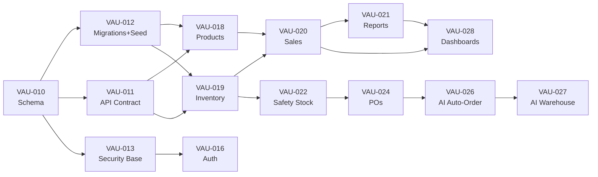

# Vaultory — End-to-End Implementation Plan (v2)

> **Project:** Vaultory — Small Business Inventory & Sales App (SBISA)
> **Timeline:** 29 Aug – 30 Sep 2026 (3 sprints × ~11 days)
> **Submission deadline:** 30 Sep 2026
> **Aligned to:** Sprint Planner **v2.2** · BRD v3.4 · SRS v1.1 · SOW v1.2
> **Date of this plan:** 30 Aug 2026

---

## Current State Assessment

### What's Done ✅
| Area | Status |
|---|---|
| **Docs** | BRD v3.4, SRS v1.1, SOW v1.2, Sprint Planner v2.2 — all drafted, pending sign-off |
| **Backend scaffold** (VAU-001,003) | Express 5 + TS (ESM), Zod env validation, Supabase client (anon + service-role), JWT auth middleware (`requireAuth`/`requireRoles`), error handler, health check, rate limiting, helmet, CORS |
| **Frontend scaffold** (VAU-002) | React 19 + Vite + Tailwind v4 + shadcn/ui (25 UI components), routing (9 placeholder pages), API client with token injection, Zustand auth store, TanStack Query, React Hook Form + Zod, Recharts, theme toggle, responsive sidebar layout |
| **Supabase** (VAU-004) | Client configured (env vars ready), no project provisioned yet |
| **Deployment** (VAU-005) | `dist/` builds exist; not yet deployed to Vercel/Render |

### What Needs Building ❌ (mapped to VAU tickets)

| Sprint | VAU Tickets | What's Missing |
|---|---|---|
| **S1** | VAU-006, 010–014 | CI/CD, DB schema+migrations+seed, API contract+types, RBAC/masking/audit utilities, frontend foundations (auth guards, query hooks, shared UI kit) |
| **S2** | VAU-016–025 | Auth flow, user admin, products+categories, inventory+stock ops, sales+void/returns, reports, safety stock+alerts, suppliers, POs, RBAC enforcement |
| **S3** | VAU-026–037 | AI engine (Groq), AI warehouse recs, dashboards, value-adds (bulk/audit/onboarding/fast-slow), QA, UAT, user guide, handover |

---

## Sprint 1 — Foundations & Architecture (29 Aug – 8 Sep)

**Sprint Goal:** Dev-ready foundation — schema + API contract + security base + frontend foundations all merged; live skeleton on Vercel/Render.

**Committed points:** 71 pts (Must 58 + Should/Could 13)

---

### VAU-006 · CI/CD (Should · 5 pts)

#### [NEW] `.github/workflows/ci.yml`
- Lint + build + typecheck on push/PR for both `backend/` and `frontend/`

#### [MODIFY] Vercel/Render settings
- Connect GitHub repo for auto-deploy on `main` push
- Set environment variables (Supabase, Groq, CLIENT_ORIGIN)

---

### VAU-010 · Database Schema (Must · 13 pts)

> The heavyweight ticket — defines the entire data model for the project.

#### [NEW] `backend/src/db/schema.sql`
Full PostgreSQL DDL per SRS §6.1:

```
users              (id UUID PK = auth.uid(), name, role ENUM, store_id FK?, status, timestamps)
locations          (id, type ENUM(store,warehouse), name, city, address, status)
categories         (id, name, parent_id FK?, status)
units              (id, name)
products           (id, sku_code UNIQUE, name, description, category_id FK, unit_id FK,
                    cost_price DECIMAL(12,2) [MASKED], sale_price, default_safety_stock,
                    default_reorder_point, default_target_level, is_perishable, shelf_life_days, status)
suppliers          (id, name, contact_person, phone, email, address, lead_time_days, status)
supplier_products  (supplier_id FK, product_id FK, PK)
inventory          (product_id FK, location_id FK, qty_on_hand INT, PK(product_id, location_id))
safety_stock_rules (product_id FK, location_id FK?, safety_stock, reorder_point,
                    target_level, auto_order_enabled BOOL)
purchase_orders    (id, po_number UNIQUE, supplier_id FK, destination_id FK, status ENUM,
                    order_date, expected_date, received_date?, created_by FK)
po_lines           (id, po_id FK, product_id FK, qty INT, received_qty INT DEFAULT 0)
sales              (id, store_id FK, sale_datetime, total DECIMAL(12,2),
                    status ENUM(active,voided), created_by FK)
sale_lines         (id, sale_id FK, product_id FK, qty INT, unit_price, line_total)
stock_movements    (id, product_id FK, location_id FK, type ENUM, qty, ref?, reason?,
                    created_by FK, created_at)
alerts             (id, type ENUM, product_id?, location_id?, message, target_role, read BOOL)
ai_recommendations (id, product_id FK, location_id FK, type ENUM, recommended_value,
                    reasoning TEXT, status ENUM, created_at)
audit_logs         (id, actor_id FK, action, entity, entity_id?, detail JSON, created_at)
```

- All FK constraints, CHECK constraints (`qty_on_hand ≥ 0`, `qty > 0`), indexes per SRS §6.2–6.3
- ERD diagram (Mermaid) for documentation

---

### VAU-011 · API Contract (Must · 8 pts)

#### [NEW] `backend/src/lib/schemas/`
Zod schemas for every entity and every request/response, organized by module:
- `products.schema.ts` — CreateProduct, UpdateProduct, ProductResponse
- `inventory.schema.ts` — StockIn, StockOut, Transfer, Adjust, InventoryResponse
- `sales.schema.ts` — CreateSale, SaleLineItem, SaleResponse, VoidSale
- `purchase-orders.schema.ts` — CreatePO, ReceivePO, POResponse
- `suppliers.schema.ts` — CreateSupplier, SupplierResponse
- `safety-stock.schema.ts` — SafetyStockConfig, SafetyStockResponse
- `users.schema.ts` — CreateUser, UpdateUser, UserResponse
- `alerts.schema.ts` — AlertResponse
- `reports.schema.ts` — DailyReport, QuarterlyReport, YearlyReport params
- `ai.schema.ts` — ForecastResponse, RecommendationResponse, AcceptRejectAction
- `common.schema.ts` — Pagination, ErrorEnvelope, IdParam

#### [NEW] `backend/src/lib/endpoints.ts`
- Endpoint catalogue: every route, method, auth requirement, role restrictions — as a reference doc embedded in code comments

---

### VAU-012 · Migrations & Seed (Must · 5 pts)

#### [NEW] `backend/src/db/migrations/001_initial.sql`
- The DDL from VAU-010, formatted as a runnable migration

#### [NEW] `backend/src/db/seed.sql`
- 3 stores (Store A, B, C) + 1 Central Warehouse
- Default categories (Electronics, Grocery, Clothing, Beverages, etc.) + units (pcs, kg, liters, etc.)
- 10+ sample products with SKUs, prices, safety stock levels
- 3 suppliers with product mappings
- Opening inventory for all locations
- Test users: 1 Admin, 1 Store Staff per store, 1 Sales Personnel, 1 Senior Stakeholder

---

### VAU-013 · Security Base — Backend (Must · 8 pts)

#### [MODIFY] [`auth.ts`](file:///Users/anoop/FY%20BTECH/Sem-5/PM_Project/backend/src/middleware/auth.ts)
- Update `Role` type → `'admin' | 'store_staff' | 'sales_personnel' | 'senior_stakeholder'`
- Store-scoping middleware: staff can only access their own store's data

#### [NEW] `backend/src/lib/masking.ts`
- `maskValue(value, userRole)` → returns `"••••"` for unauthorized roles, clear text for Admin
- Field-level masking config: which fields are masked, which roles can unmask

#### [NEW] `backend/src/lib/audit.ts`
- `logAudit(actorId, action, entity, entityId, detail)` → appends to `audit_logs` table
- Masked values never written to audit detail

#### [NEW] `backend/src/lib/db.ts`
- Supabase query helper with consistent error handling
- Transaction wrapper for ACID operations (stock mutations)

#### [NEW] `backend/src/lib/permissions.ts`
- Permission matrix (BRD §12) as a typed constant
- `checkPermission(role, module, action)` → boolean
- Used by route handlers alongside `requireRoles()`

---

### VAU-014 · Frontend Foundations (Must · 8 pts)

#### [MODIFY] [`types.ts`](file:///Users/anoop/FY%20BTECH/Sem-5/PM_Project/frontend/src/lib/types.ts)
- Align all types to the Zod schemas from VAU-011
- Add all entity types (Location, Category, Unit, Supplier, SafetyStockRule, Alert, AiRecommendation, AuditLog, StockMovement)

#### [NEW] `frontend/src/lib/query-keys.ts`
- Centralized TanStack Query key factory for cache invalidation

#### [NEW] `frontend/src/hooks/use-*.ts`
- `useProducts()`, `useInventory()`, `useSales()`, `usePurchaseOrders()`, `useSuppliers()`, `useAlerts()`, `useDashboard()` — TanStack Query hooks wrapping the API client

#### [NEW] `frontend/src/components/shared/`
- `DataTable` — reusable table with sort, filter, pagination (shadcn Table + custom logic)
- `FormDialog` — reusable create/edit dialog pattern
- `StatusBadge` — colored badge for stock status (IN/LOW/OUT/OVER)
- `CsvExportButton` — download any dataset as CSV
- `PageHeader` — consistent page header with title + actions
- `EmptyState` — empty state placeholder for lists
- `ConfirmDialog` — confirmation modal for destructive actions
- `MaskedValue` — shows `"••••"` or real value based on role

#### [MODIFY] [`router.tsx`](file:///Users/anoop/FY%20BTECH/Sem-5/PM_Project/frontend/src/router.tsx)
- Add `/login` route
- Auth guard wrapper (redirect to login if not authenticated)
- Role-based route protection per BRD §12

#### [MODIFY] [`auth-store.ts`](file:///Users/anoop/FY%20BTECH/Sem-5/PM_Project/frontend/src/stores/auth-store.ts)
- Wire to Supabase Auth SDK for session persistence
- Store full user profile (role, store_id, name) from backend `/api/auth/me`
- Token refresh handling

---

## Sprint 2 — Core Full-Stack Modules (9 Sep – 19 Sep)

**Sprint Goal:** Every core module usable end-to-end — client can log in, manage products/stock, record sales, view reports, run POs with goods-in, safety-stock advisories live.

**Committed points:** 106 pts (Must 88 + Should 13 + Could 5)

> [!NOTE]
> Each story below is a **full-stack vertical slice** — one developer owns DB→API→UI for the entire module.

---

### VAU-016 · Auth Module (Must · 13 pts)

#### [MODIFY] `backend/src/modules/auth/auth.routes.ts`
- `POST /api/auth/signup` — create user via Supabase Auth + profile row
- `POST /api/auth/signin` — email/password sign-in
- `POST /api/auth/otp` — send email OTP magic link
- `POST /api/auth/verify-otp` — verify OTP code
- `POST /api/auth/forgot-password` — trigger password reset email
- `POST /api/auth/reset-password` — set new password with token
- `POST /api/auth/signout` — invalidate session
- `GET /api/auth/me` — return authenticated user profile with role

#### [NEW] `frontend/src/pages/login.tsx`
- Email + password form
- Email OTP / magic link toggle
- Forgot password flow
- Role-aware redirect after login (Admin→Dashboard, Staff→Inventory, Sales→Sales, Senior→Executive)

#### [MODIFY] `frontend/src/stores/auth-store.ts`
- Full session lifecycle (login, logout, token refresh, persist)

---

### VAU-017 · User Admin Module (Must · 8 pts)

#### [NEW] `backend/src/modules/users/`
- `GET /api/users` — list users (Admin only), searchable, filterable
- `POST /api/users` — create user (Supabase Auth + profile), assign role + store
- `PATCH /api/users/:id` — edit name, role, store
- `PATCH /api/users/:id/deactivate` — soft deactivate
- `POST /api/users/:id/reset-password` — trigger password reset
- Guard: cannot deactivate self

#### [NEW] `frontend/src/pages/users.tsx`
- User DataTable with search, filter by role/status
- Create/edit FormDialog (name, email, role, store assignment)
- Activate/deactivate toggle with ConfirmDialog

---

### VAU-018 · Products & Categories Module (Must · 13 pts)

#### [NEW] `backend/src/modules/products/`
- `POST /api/products` — create (Admin only), SKU uniqueness, validate `target ≥ reorder ≥ safety`
- `GET /api/products` — list with search, filter (category, status), pagination, `cost_price` masked per role
- `GET /api/products/:id` — detail
- `PATCH /api/products/:id` — edit
- `PATCH /api/products/:id/archive` — soft deactivate (blocks new transactions, keeps in history)
- Error: `409 SKU_ALREADY_EXISTS`, `422 INVALID_PRICE`

#### [NEW] `backend/src/modules/categories/`
- `GET /api/categories` — tree list
- `POST/PATCH /api/categories` — CRUD (no hard delete if in use)
- `GET /api/units`, `POST/PATCH /api/units` — units CRUD

#### [NEW] `frontend/src/pages/products.tsx`
- Product DataTable: SKU, name, category, unit, sale_price, cost_price (masked), status
- Search + filter by category/status
- Create/edit FormDialog (all fields from SRS §4.1.1)
- Archive button with ConfirmDialog
- Category/unit inline management (dialog or settings sub-page)

---

### VAU-019 · Inventory & Stock Module (Must · 13 pts)

#### [NEW] `backend/src/modules/inventory/`
- `GET /api/inventory` — per-location stock grid with status badges (computed: IN/LOW/OUT/OVER per SRS §4.1.3)
- `GET /api/inventory/:productId/:locationId` — single stock record
- `POST /api/inventory/stock-in` — qty_on_hand += qty, optional PO link, writes `stock_movements`
- `POST /api/inventory/stock-out` — qty_on_hand -= qty, no-negative guard (`409 INSUFFICIENT_STOCK`), reason required
- `POST /api/inventory/transfer` — atomic from→to (single transaction, net zero)
- `POST /api/inventory/adjust` — cycle count: compute variance, confirm → set qty, audit log
- After every mutation: re-evaluate status, trigger alert if LOW/OUT
- Store staff scoped to own store

#### [NEW] `frontend/src/pages/inventory.tsx` (replaces placeholder)
- Location selector (store/warehouse tabs or dropdown)
- Stock DataTable: product, on-hand, safety, reorder, target, status badge (color-coded), last-updated
- Action buttons per row: Stock-In, Stock-Out, Transfer, Adjust → each opens FormDialog
- Variance preview for adjustments before confirm
- Toast feedback (Sonner) on success
- Store staff see only their store

---

### VAU-020 · Sales Module (Must · 13 pts)

#### [NEW] `backend/src/modules/sales/`
- `POST /api/sales` — record sale: store, datetime, line items [{product, qty, unit_price}]
  - Server-computes line_total + sale total
  - Auto-deducts stock per line at sale's store
  - Block if qty > on-hand (`409 INSUFFICIENT_STOCK` identifying which product)
  - Writes `stock_movements` + `audit_logs`
  - Sale immutable after save (except void)
- `GET /api/sales` — list with filters (store, date range), pagination
- `GET /api/sales/:id` — detail with line items
- `POST /api/sales/:id/void` — Admin only, reason required, restores stock, marks voided, audit logged
- `POST /api/sales/:id/return` — return line items, stock increase, negative sale recorded

#### [NEW] `frontend/src/pages/sales.tsx` (replaces placeholder)
- Record sale form: store selector, line items table (product autocomplete, qty, price), live totals
- Inline stock sufficiency check (red warning per line if insufficient)
- Save → confirmation → toast
- Sale history list with detail drawer/modal
- Void button (Admin only) with reason + ConfirmDialog

---

### VAU-021 · Reports Module (Must · 13 pts)

#### [NEW] `backend/src/modules/reports/`
- `GET /api/reports/sales/daily` — filter: store_id, product_id, date → units_sold, sales_value by store/product
- `GET /api/reports/sales/quarterly` — filter: store_id, product_id, quarter (YYYY-Qq)
- `GET /api/reports/sales/yearly` — filter: store_id, product_id, year (YYYY)
- `GET /api/reports/store-performance` — per-store totals, cross-store comparison
- All: sortable, support CSV/PDF export data format

#### [NEW] `frontend/src/pages/reports.tsx` (replaces placeholder)
- Tabs: Daily / Quarterly / Yearly / Store Performance
- Filter bar: store, product, date/quarter/year selectors
- DataTable with results (units, value, by store, by product)
- Recharts bar/line charts for visual trends
- Export buttons: CSV (client-side download), PDF (browser print CSS)
- Store-wise performance view: side-by-side store comparison chart

---

### VAU-022 · Safety Stock & Alerts (Should · 8 pts)

#### [NEW] `backend/src/modules/safety-stock/`
- `GET /api/safety-stock` — list rules per product/location
- `PUT /api/safety-stock/:productId/:locationId` — set/update (validate `target ≥ reorder ≥ safety ≥ 0`)
- `auto_order_enabled` toggle per rule

#### [NEW] `backend/src/modules/alerts/`
- Alert creation: triggered by inventory mutations when status transitions to LOW/OUT
- `GET /api/alerts` — role-scoped list (Admin sees all, staff sees own store)
- `PATCH /api/alerts/:id/read` — mark as read
- `GET /api/alerts/unread-count` — for badge in header

#### [NEW] `frontend/src/pages/safety-stock.tsx`
- Config table: product × location with inline-edit fields (safety, reorder, target, auto-order toggle)
- Validation feedback
- "Suggest by AI" button (stub in S2, wired in S3)

#### [NEW] `frontend/src/components/alerts-center.tsx`
- Bell icon in header/sidebar with unread badge count
- Dropdown panel: alert list with read/unread, type filter
- Click-through: navigates to relevant product/location

---

### VAU-023 · Suppliers Module (Should · 8 pts)

#### [NEW] `backend/src/modules/suppliers/`
- `POST /api/suppliers` — create (Admin only)
- `GET /api/suppliers` — list with search
- `GET /api/suppliers/:id` — detail
- `PATCH /api/suppliers/:id` — edit
- `POST /api/suppliers/:id/products` — map products (many-to-many)
- `GET /api/suppliers/:id/performance` — on-time delivery %, effective lead time

#### [NEW] `frontend/src/pages/suppliers.tsx`
- Supplier DataTable: name, contact, lead time, status, reliability score
- Create/edit FormDialog
- Product mapping panel (multi-select products)
- Performance column (computed from PO data — wired once POs exist)

---

### VAU-024 · Purchase Order Module (Must · 13 pts)

#### [NEW] `backend/src/modules/purchase-orders/`
- `POST /api/purchase-orders` — manual PO creation (supplier, destination, line items [{product, qty}])
  - Auto-generate `po_number` (`PO-YYYY-SEQ`)
  - `expected_date = order_date + supplier.lead_time_days`
- `GET /api/purchase-orders` — list with filters (status, supplier, destination)
- `GET /api/purchase-orders/:id` — detail with line items + receipt progress
- `PATCH /api/purchase-orders/:id/status` — lifecycle transitions:
  - `DRAFT → SENT → PARTIALLY_RECEIVED → RECEIVED → CLOSED`; any → `CANCELLED`
  - State transitions logged (actor, timestamp)
- `POST /api/purchase-orders/:id/receive` — goods-in: per-line `received_qty`, stock increase at destination
  - Partial → `PARTIALLY_RECEIVED`; all lines fully received → `RECEIVED`
  - Over-receipt guard: `received_qty + previous ≤ ordered_qty`
- Duplicate-open-PO prevention: block auto-PO if open PO exists for same (product, destination)

#### [NEW] `frontend/src/pages/purchase-orders.tsx` (replaces placeholder)
- PO list: number, supplier, destination, status badge, expected date, receive progress bar
- PO detail view: line items table with ordered vs. received columns
- Create manual PO form: supplier selector, destination, product lines
- Receive button → FormDialog to enter received quantities per line
- Status transition buttons (Send, Cancel, Close)

---

### VAU-025 · RBAC Enforcement (Should · 5 pts)

#### [MODIFY] All backend route files
- Apply `requireAuth` + `requireRoles(...)` per BRD §12 permission matrix to every route
- Store-scoping: Staff routes filtered to `req.storeId`

#### [MODIFY] [`app-sidebar.tsx`](file:///Users/anoop/FY%20BTECH/Sem-5/PM_Project/frontend/src/components/layout/app-sidebar.tsx)
- Conditionally show/hide nav items based on user role
- Admin: all items | Staff: Inventory, PO receive | Sales: Sales, Reports | Senior: Dashboard, Reports, Executive

#### [MODIFY] [`router.tsx`](file:///Users/anoop/FY%20BTECH/Sem-5/PM_Project/frontend/src/router.tsx)
- Route-level role guards (redirect to dashboard if unauthorized)

---

## Sprint 3 — AI, Dashboards, Value-Adds, Test & Handover (20 Sep – 30 Sep)

**Sprint Goal:** AI features live, executive + KPI dashboards, value-adds delivered (capacity permitting), QA/UAT passed, product accepted and handed over.

**Committed points:** 79 pts (Must 43 + Should 23 + Could 13; excl. variable defect fixes)

---

### VAU-026 · AI Auto-Ordering (Must · 13 pts)

#### [NEW] `backend/src/modules/ai/groq-client.ts`
- Groq API wrapper (chat completions) with retry, timeout, rate-limit handling
- API key from env var (`GROQ_API_KEY`)
- Graceful degradation if key missing or API unavailable

#### [NEW] `backend/src/modules/ai/forecast.ts`
- **Demand forecasting:**
  - Input: product sales history (90-day window, min 14 days)
  - Primary: structured prompt → Groq → parse demand number + reasoning
  - Fallback: simple moving average (SMA) in Node.js if Groq unavailable or insufficient data
  - Output: `{ predicted_demand, confidence, reasoning, sourced_from_ai }`

#### [NEW] `backend/src/modules/ai/auto-order.ts`
- **Auto-ordering flow** per SRS §8.1:
  1. Scan all products where `qty_on_hand ≤ reorder_point` at any location
  2. Skip if `auto_order_enabled = false` → just alert
  3. Skip if open PO exists for `(product, location)` → no duplicate
  4. Skip if no supplier mapped → `NO_SUPPLIER` alert
  5. Compute: `reorder_qty = max(0, target_level − on_hand − open_po_qty)`; if forecast available, `max(reorder_qty, ceil(forecast))`
  6. Create PO (DRAFT or auto-SENT per config)
  7. Edge cases: no history → fallback qty, missing lead time → default 7d + alert
- Trigger: POST endpoint (cron-callable) + after-stock-mutation hook
- All inputs/outputs → `ai_recommendations` table

#### [NEW] `frontend/src/pages/auto-order.tsx` (replaces placeholder)
- AI Recommendation Center
- Pending recommendations table: product, location, suggested qty, reasoning, confidence
- Actions: Accept (creates PO), Modify (edit qty then accept), Reject (logged)
- History tab: past recommendations with outcomes

---

### VAU-027 · AI Warehouse Recommendations (Must · 13 pts)

#### [NEW] `backend/src/modules/ai/warehouse-recommend.ts`
- Per (product, warehouse): forecast × (lead_time + safety_buffer)
- Groq for reasoning/rationale string; fallback template if unavailable
- Clamp to [safety_stock, target_level]
- Store recommendation with rationale in `ai_recommendations`

#### [MODIFY] `frontend/src/pages/auto-order.tsx`
- Add "Warehouse Recommendations" tab
- Per-warehouse recommendation cards with rationale text
- Accept / Modify / Reject → updates `safety_stock_rules`

#### [MODIFY] `frontend/src/pages/safety-stock.tsx`
- Wire "Suggest by AI" button → calls warehouse recommendation endpoint
- Show recommendation modal with rationale, accept/modify/reject

---

### VAU-028 · Dashboard Module (Must · 8 pts)

#### [NEW] `backend/src/modules/dashboard/`
- `GET /api/dashboard/summary` — aggregated KPIs:
  - Total stock value (Σ qty × cost_price across all locations)
  - Inventory turnover rate
  - Low-stock count, out-of-stock count
  - Today's sales total, today's order count
  - Auto-orders pending
- `GET /api/dashboard/revenue-trend` — daily revenue for last 30 days (time series)
- `GET /api/dashboard/top-products` — top 10 products by qty sold (rolling 30d)
- `GET /api/dashboard/store-comparison` — per-store sales totals for comparison

#### [NEW] `frontend/src/pages/dashboard.tsx` (replaces placeholder)
- **Role-aware layout:**
  - **Admin/Senior Stakeholder:** KPI cards (stock value, turnover, low/out counts, today's sales) + revenue trend Recharts line chart + top products bar chart + low-stock alert list
  - **Store Staff:** own-store stock status summary + quick action buttons (stock-in/out/transfer)
  - **Sales Personnel:** today's sales stats + store performance summary
- All widgets clickable → navigate to detail page

#### [NEW] `frontend/src/pages/executive-dashboard.tsx`
- Senior Stakeholder / Admin exclusive
- Consolidated: all-store inventory health + sales summary
- Store comparison charts (grouped bar chart)
- Drill-down: click store → filtered inventory/sales view

---

### VAU-029 · Value-Add Modules (Could · 13 pts)

> [!NOTE]
> Delivered only if Must/Should items are ahead of schedule. Each sub-module is independently droppable.

#### Fast/Slow Mover Classification
- Backend: `GET /api/products/movers` — classify by sales velocity (90-day rolling), configurable thresholds
- Frontend: badge on product list + dashboard widget

#### Bulk CSV Import/Export
- Backend: `POST /api/bulk/import/products` — CSV upload, validate, per-row result; `GET /api/bulk/export/:entity` — CSV download (respects masking)
- Frontend: import dialog (file upload + results table), export button on all list pages

#### Audit Log Viewer
- Backend: `GET /api/audit-logs` — Admin only, filterable (actor, action, entity, date range), paginated
- Frontend: `frontend/src/pages/audit-logs.tsx` — read-only DataTable with filters

#### Onboarding Wizard
- Frontend: `frontend/src/pages/onboarding.tsx` — 6-step guided setup (locations → users → products → suppliers → opening stock → safety stock)
- Skippable, resumable, per-step validation

#### Alert Preferences
- Backend: per-user alert type toggles
- Frontend: settings panel for alert preferences

---

### VAU-030–033 · QA, Testing & Bug Fixes (Must · 8+var pts)

#### Full Test Pass (T-AC1…T-AC14)
| Test | What | Expected |
|---|---|---|
| T-AC1 | View stock for all products across 3 stores + warehouse | Grid shows correct qty & status, ≤3s |
| T-AC2 | Stock-In/Out/Transfer/Adjust | qty updates; no negative; audit logged |
| T-AC3 | Record sale → check stock & reports | Totals correct; stock decremented; reports reflect |
| T-AC4 | Safety stock config + stock below reorder | LOW_STOCK alert; reorder evaluation |
| T-AC5 | Auto-order at reorder point | Auto-PO generated with correct qty |
| T-AC6 | PO end-to-end | Status transitions; goods-in increases stock |
| T-AC7 | AI warehouse recommendation | Rationale shown; accept/modify/reject works |
| T-AC8 | Sales personnel store performance | Per-store + comparison correct |
| T-AC9 | Executive dashboard | KPIs + drill-down, near real-time |
| T-AC10 | Login (email/password + OTP) + RBAC | Auth works; unauthorized → 403 |
| T-AC11 | Masking | Cost price masked to non-Admin in API/DB/exports |
| T-AC12 | Hosting | Live on Vercel + Render + Supabase |
| T-AC13 | Performance | Dashboards ≤3s |
| T-AC14 | Out-of-scope | Client sign-off confirmed |

---

### VAU-034 · User Guide (Must · 3 pts)

#### [NEW] `Docs/User_Guide.md`
- Per-role walkthrough: login, key tasks, screenshots
- Admin: manage products, users, suppliers, POs, safety stock, view AI recommendations
- Store Staff: stock operations, receive goods
- Sales: record sales, view performance
- Senior: dashboard, executive monitoring, reports

---

### VAU-035–037 · Acceptance, Handover & Final Report (Must · 7 pts)

#### Handover Checklist
- [ ] Source code in Git, clean, linted, documented
- [ ] README with getting-started, architecture, env var guide
- [ ] Live URLs (Vercel frontend + Render backend)
- [ ] Supabase project access (or credentials doc)
- [ ] Groq API key documentation
- [ ] Deployment instructions (how to redeploy)
- [ ] User Guide delivered
- [ ] Acceptance form signed

---

## Execution Strategy & Critical Path

### Critical Path (sequential dependencies)



### Parallelization Opportunities

| Can run in parallel | Why |
|---|---|
| VAU-010 (Schema) + VAU-014 (Frontend Foundations) | Backend vs. frontend, no dependency |
| VAU-016 (Auth) + VAU-018 (Products) | Independent modules after schema is ready |
| VAU-019 (Inventory) + VAU-023 (Suppliers) | Independent data domains |
| VAU-020 (Sales) ∥ VAU-024 (POs) | After inventory is done, both can proceed |
| VAU-026 (AI) ∥ VAU-028 (Dashboard) | Independent Sprint 3 modules |
| VAU-029 sub-modules (Bulk, Audit, Onboarding) | All independent of each other |

### If Time Gets Tight — What to Cut

| Priority | Item | Impact of cutting |
|---|---|---|
| Cut first | VAU-029: Onboarding wizard, alert prefs, fast/slow movers | Nice-to-have; doesn't affect core scoring |
| Cut second | VAU-029: Bulk import/export | Manual data entry still works |
| Cut third | VAU-022: Safety stock (Should) | Alerts still work from inventory; just no config UI |
| Never cut | VAU-026/027 (AI), VAU-028 (Dashboard), VAU-020 (Sales), VAU-019 (Inventory) | Core problem statement requirements |

---

## What I Can Build Right Now

If you approve, I'll start executing immediately in this order:
1. **VAU-010** — Database schema (`schema.sql`)
2. **VAU-011** — API contract (Zod schemas)
3. **VAU-013** — Role alignment + masking + audit utilities
4. **VAU-014** — Frontend foundations (types, hooks, shared components)
5. **VAU-012** — Seed data

Then move straight into Sprint 2 modules.

---

> [!TIP]
> **Next step:** Answer the 5 open questions and approve this plan — I'll start building the database schema and Sprint 1 foundation immediately.
